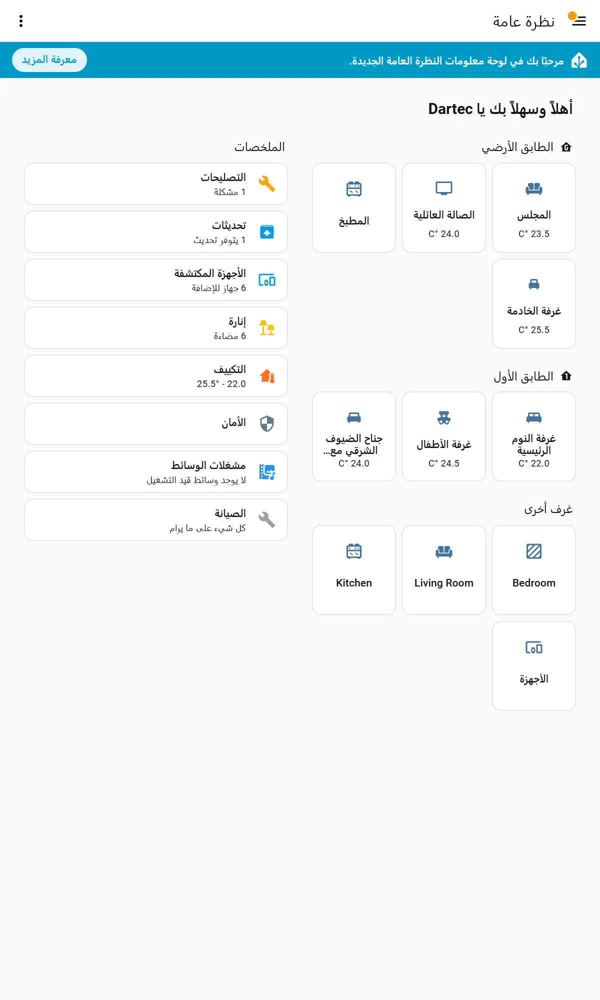
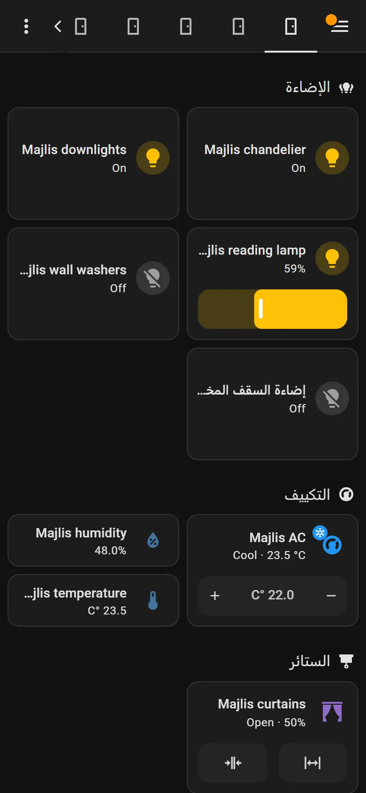
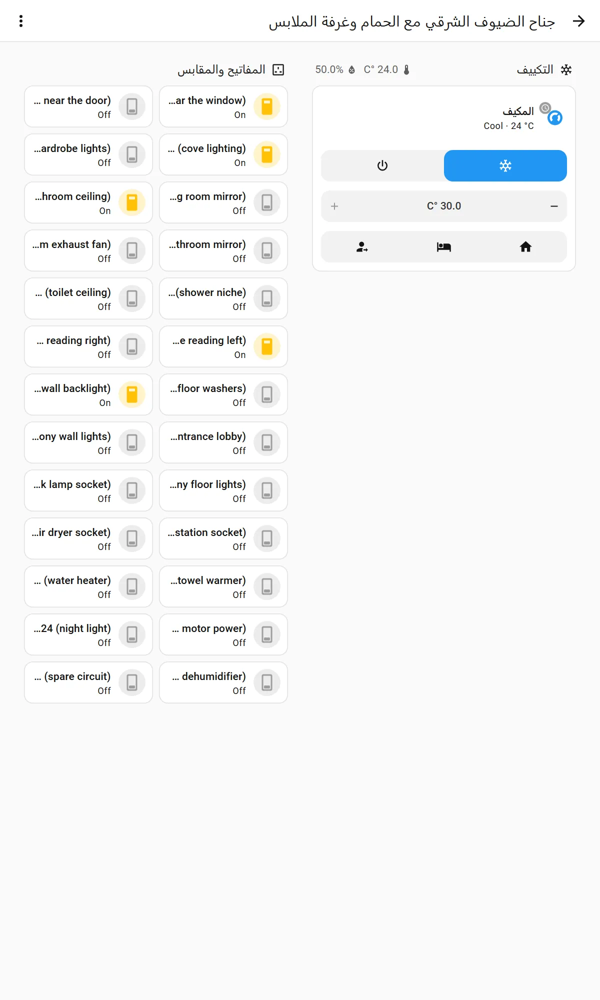
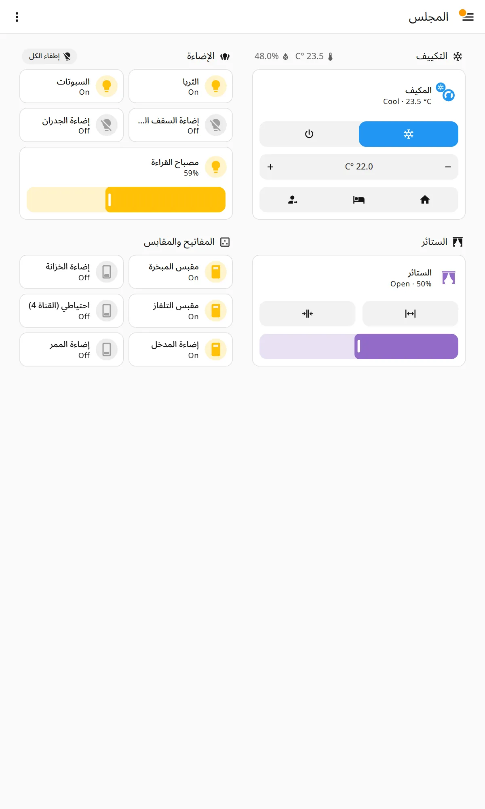
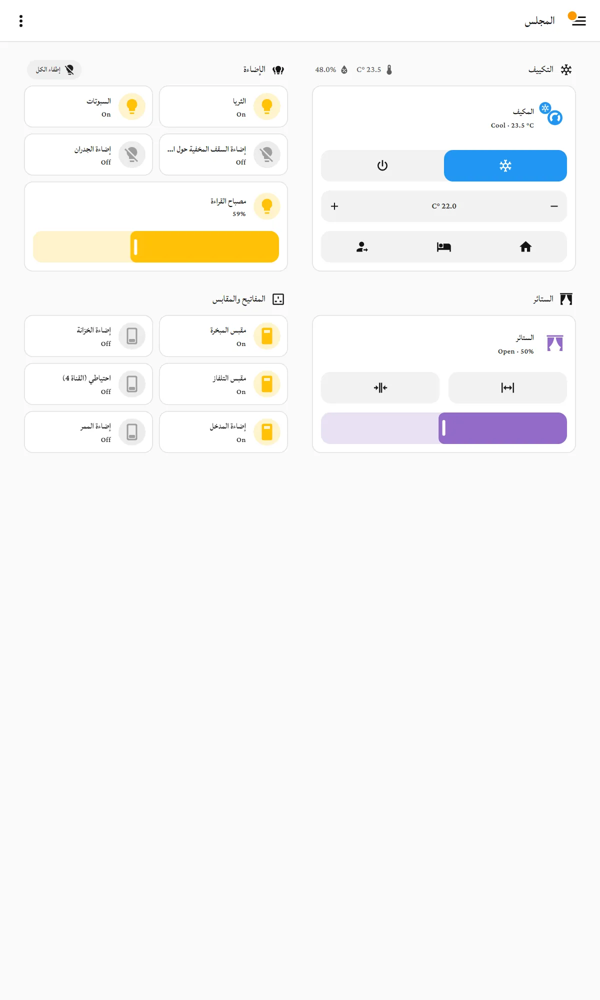

# Arabic and right-to-left

Tested on the bench, HA 2026.9.3. The bench's admin account was switched to
Arabic through its own user data, the same setting a homeowner changes in
their profile, and switched back afterwards. Screenshots with `-ar` in their
name are that account in Arabic.

## What Home Assistant does well

- **The language belongs to the account, not the browser.** Since 2025 the
  profile's language, number format and time format are stored on the server
  per user ([user settings](https://www.home-assistant.io/docs/configuration/user-configuration/)).
  A panel account set to Arabic stays Arabic on any tablet it signs in to.
- **Choosing Arabic mirrors the whole interface.** The frontend marks `ar` as
  right-to-left (`translationMetadata.json`) and flips the page: the menu moves
  to the right, sections run right to left, sliders fill from the right, and
  the + and − of a stepper swap sides. Every built-in card we used mirrored
  correctly: tile, heading, area, thermostat, button, clock and entity-filter.
- **HA's own interface is translated.** The built-in Overview, its summaries
  and its welcome banner all appeared in Arabic.
- **Arabic room names are fine.** A 43-character room name,
  جناح الضيوف الشرقي مع الحمام وغرفة الملابس, fitted on a phone tile in the
  prototype overview. On HA's own Overview it wraps onto two lines and then
  truncates.
- **The clock follows the language**, and shows 12-hour time with the Arabic
  PM marker.

## What breaks

| Problem | Seen where | Whose it is | Fix |
|---|---|---|---|
| **State words are still English**: "On", "Off", "Cool", "Open", "Closed", "Idle" | Every tile | Home Assistant's Arabic translation. We read `frontend/get_translations` for Arabic: `light … state.on` is literally "On", and so are switch off, climate cool and cover open. They were never translated, so the English falls through | Contribute the translations to Home Assistant, which translates through Lokalise ([R12](recommendations.md)). This fixes it for every Arabic user of HA, not only Dartec's |
| **Temperatures read "C° 22.0"** | Heading badges, the target-temperature stepper, and HA's own Overview room cards | Home Assistant. The number and the unit are laid out as separate runs in a right-to-left paragraph, so the unit lands on the wrong side. When the state is mixed with a Latin word ("Cool · 23.5 °C") it comes out right | Report upstream (R12). Nothing in a dashboard can fix it |
| **English names lose their beginning** in an Arabic layout: "…jlis wall washers", "…near the door" | Today's generator, where names are HA's own (English) | Ours. An English name in a right-to-left tile is truncated at its start, which is the part that says what it is | Write Arabic names ([R4](recommendations.md)). Where a name must stay English (a model number), keep it short |
| **Long Arabic names in an English layout lose their beginning** too: "…حول المجلس الرئيسي" | Today's generator in English | Ours, for the same reason in the other direction | Use each language's own names in each language's dashboard |
| **Headings, room names and tile names are not translated** | Everywhere | By design: HA translates its own strings, and names are whatever the installer typed | The generator writes the Arabic itself. Today it writes Arabic section headings (unreviewed) but English or raw device names |
| **Entity and area ids are transliterated**, e.g. `light.d_lsqf_lmkhfy_hwl_lmjls_lryysy`, and the floor الطابق الأرضي becomes `ltbq_lrdy` | The registry | Home Assistant's slug rules. Harmless to users, but ids like these are unreadable in logs and support | Create areas and entities with an ASCII name first, then rename them to Arabic. The id stays readable |
| **Mixed text in one tile** reads oddly: English device names and English states under an Arabic heading | Crowded suite in Arabic | Ours plus HA's untranslated states | Arabic names, plus the upstream translation |

## Names: what the generator needs

HA does not translate names, so an Arabic household needs Arabic names from
somewhere. The only place that knows what each device is *for* is the plan. So:

1. The planner holds each room's name in Arabic and English. The manager's room
   dashboards already follow the room name and take their headings from
   `core.language`.
2. The planner, or the technician at commissioning, gives each placed device a
   short label in both languages, for example "الثريا" / "Chandelier". For a
   multi-channel device, it gives one label per channel.
3. The generator writes the label of the dashboard's language into each tile's
   `name`. It does not rename the entity in HA: the Arabic and English
   dashboards then both read well, and HA's own pages keep one name.

The prototypes do exactly this: [prototypes/room-majlis.ar.yaml](prototypes/room-majlis.ar.yaml)
next to [room-majlis.en.yaml](prototypes/room-majlis.en.yaml).

## Fonts

### What HA uses today

The body font is `Roboto, Noto, sans-serif`
(`typography.globals.ts`, `--ha-font-family-body`). Roboto has no Arabic
letters, so the browser picks one from the device. On the bench's Windows
screenshots we asked Chromium which font drew the Arabic: it was **Segoe UI**.
An Android tablet draws it in **Noto Naskh or Noto Sans Arabic**, which reads
well. So Arabic in HA looks acceptable on the hardware we deploy, without doing
anything. It just is not Dartec's typeface.

### Can a theme carry Dartec's fonts (Lateef for Arabic, Dubai for English)?

**A theme can name a font but cannot deliver one.** A Home Assistant theme is a
set of CSS variables. It can say `ha-font-family-body: "IBM Plex Sans Arabic",
Roboto, sans-serif`, but it cannot contain `@font-face` or the font files. The
font must also be loaded, by one of these:

| Way to load the font | Cost | Risk |
|---|---|---|
| A dashboard resource (a CSS file with `@font-face`, served from `/local/`) | One file per home plus the font files in `config/www` | Applies only on dashboard pages, not on HA's other pages |
| `frontend: extra_module_url` in `configuration.yaml` | Editing YAML in every home | We do not edit customer YAML |
| **The agent**, which already serves static files and loads `www/dashboard-fix.js` through `add_extra_js_url` | One small module plus the font files (roughly 60–150 KB per weight as woff2) shipped in the agent | Low, but it is code in every home, and a new thing for the agent to own |
| Google Fonts from the CDN | Nothing to ship | Every panel fetches fonts from Google, needs internet, and leaks requests from customer homes. **Not for a fleet** |

Then, whichever way loads it, `--ha-font-family-body` is an **unsupported**
variable in HA's terms (introduced 2025.5, "not yet in use everywhere";
[release notes](https://www.home-assistant.io/blog/2025/05/07/release-20255/)).
So it can change in any monthly release, and not every element uses it. That
is the maintenance cost; see [maintenance.md](maintenance.md).

### Which Arabic font

We previewed four in the Arabic room view, by injecting the font into our own
headless browser only (nothing on the bench changed):

| Font | At interface sizes | Licence | Verdict |
|---|---|---|---|
| **Lateef** (the storefront's Arabic font) | A traditional Naskh face with a small body. At HA's 12–14 px it is visibly smaller than the other three, and placed first in the font list it also replaced the Latin text ("Cool · 23.5 °C") with a small serif | SIL OFL 1.1 (Google Fonts) | **Not for the dashboard.** It suits the storefront's headings and body copy, not a 14 px label on a wall panel. If used at all, restrict it to Arabic with `unicode-range` and scale it up, which HA's variables cannot do per script |
| **IBM Plex Sans Arabic** | Clear, a similar weight to Latin text, and designed to pair with IBM Plex Sans, which the Dartec theme already names | SIL OFL 1.1 | **Recommended** if Dartec ships a font |
| **Noto Sans Arabic** | Clear, and what many Android tablets use already | SIL OFL 1.1 | A good choice, and nearly free: it is often already on the tablet |
| Fallback (device font) | Segoe UI on Windows, Noto on Android | n/a | Acceptable today at no cost |

**Dubai** (the storefront's English font) was not tested live: it is not on
Google Fonts, and it comes under its own end-user licence from dubaifont.com.
That licence has to be read before bundling it in the agent and serving it
from every home. Visually it would behave like any Latin sans. The same
loading mechanics and the same unsupported-variable risk apply.

**Recommendation:** keep the device font now. When Dartec ships a font, ship
**IBM Plex Sans Arabic + IBM Plex Sans** (both OFL) from the agent, named in
`ha-font-family-body` by the Dartec theme. Keep Lateef and Dubai for the
storefront and print. Recommendation R10 covers the theme side.

## Checklist for an Arabic-speaking household

- The planner's rooms have Arabic names, and devices have Arabic labels.
- Each Arabic-speaking person's profile language is العربية. It is stored on
  the server, per account. Today each person sets it in their own profile. My
  Home shows its own screens in Arabic, but it does not set a person's language.
  Adding that is part of R6.
- Each panel account's language is set when it is created (R6).
- The family's dashboards are the Arabic ones. Staff who read English get the
  English ones.
- Check one screen per room on a real tablet at handover.
