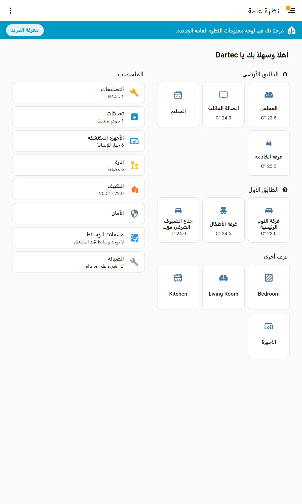
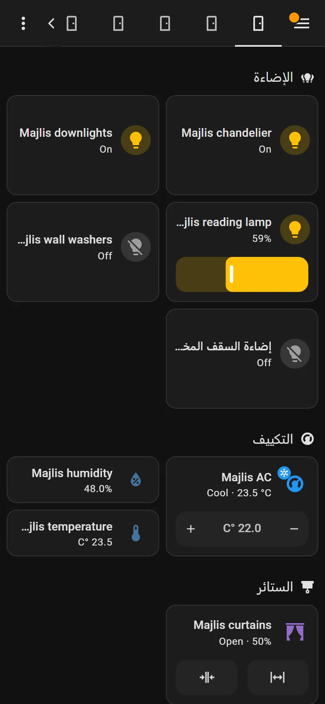
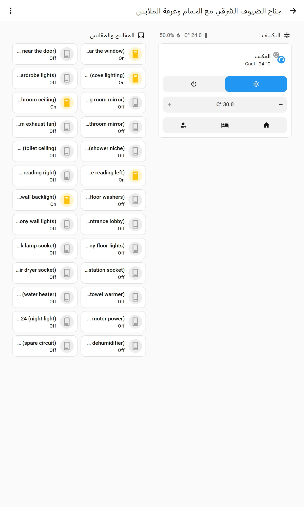
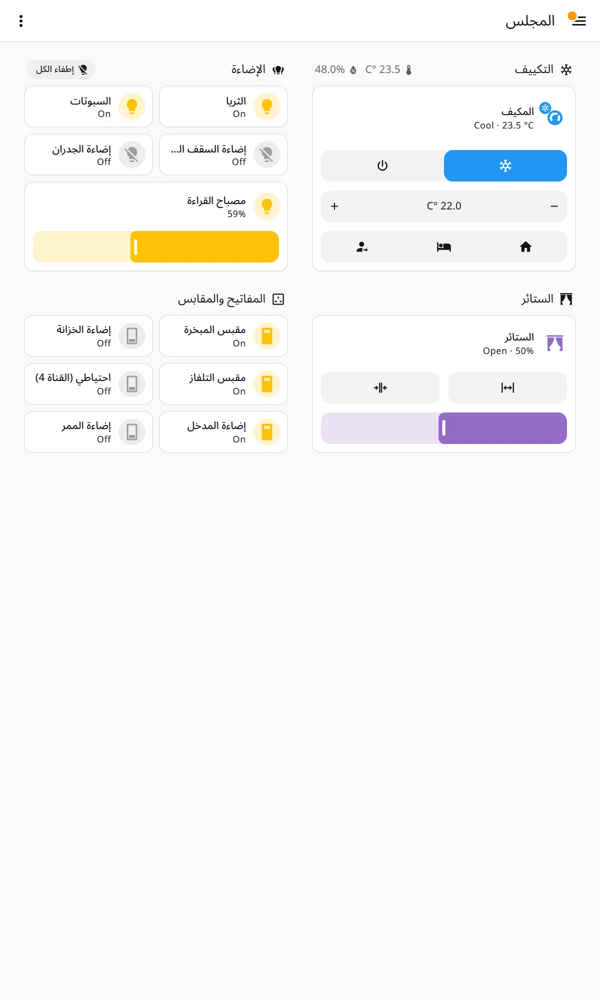
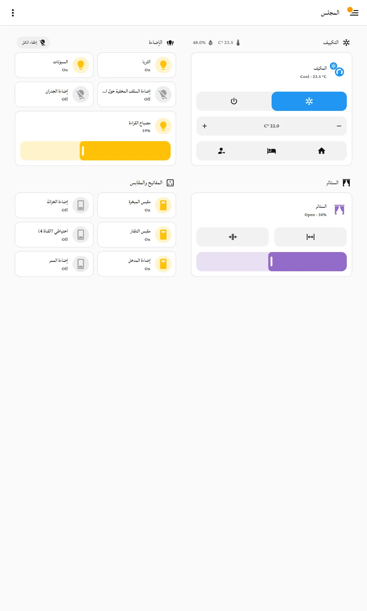
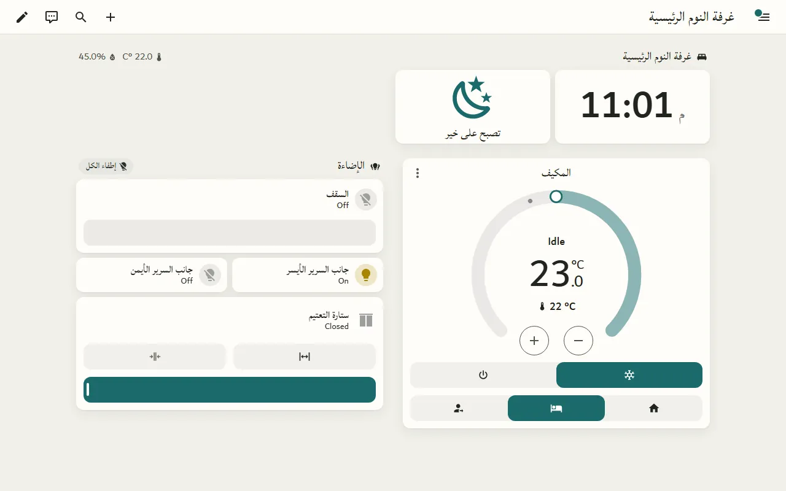

# Arabic and right-to-left

Tested on the bench, HA 2026.9.3. The bench's admin account was switched to
Arabic through its own user data, the same setting a homeowner changes in
their profile, and switched back afterwards. Screenshots with `-ar` in their
name are that account in Arabic.

## What Home Assistant does well

- **The language belongs to the account, not the browser.** Since 2025 the
  profile's language, number format and time format are stored on the server
  per user ([user settings](https://www.home-assistant.io/docs/configuration/user-configuration/)).
  A panel account set to Arabic stays Arabic on any tablet it signs in to.
- **Choosing Arabic mirrors the whole interface.** The frontend marks `ar` as
  right-to-left (`translationMetadata.json`) and flips the page: the menu moves
  to the right, sections run right to left, sliders fill from the right, and
  the + and − of a stepper swap sides. Every built-in card we used mirrored
  correctly: tile, heading, area, thermostat, button, clock and entity-filter.
- **HA's own interface is translated.** The built-in Overview, its summaries
  and its welcome banner all appeared in Arabic.
- **Arabic room names are fine.** A 43-character room name,
  جناح الضيوف الشرقي مع الحمام وغرفة الملابس, fitted on a phone tile in the
  prototype overview. On HA's own Overview it wraps onto two lines and then
  truncates.
- **The clock follows the language**, and shows 12-hour time with the Arabic
  PM marker.

## What breaks

| Problem | Seen where | Whose it is | Fix |
|---|---|---|---|
| **State words are still English**: "On", "Off", "Cool", "Open", "Closed", "Idle" | Every tile | Home Assistant's Arabic translation. We read `frontend/get_translations` for Arabic: `light … state.on` is literally "On", and so are switch off, climate cool and cover open. They were never translated, so the English falls through | Contribute the translations to Home Assistant, which translates through Lokalise ([R12](recommendations.md)). This fixes it for every Arabic user of HA, not only Dartec's. **Until then the agent shows Dartec's formal Arabic** (0.25.0, `arabic_states.py`): «مُشغَّل» / «مُطفأ», «تبريد», «مفتوح» and so on, only where HA's Arabic is still English, and HA's own word wins the day it ships one. See [Arabic state words](#arabic-state-words) |
| **Temperatures read "C° 22.0"** | Heading badges, the target-temperature stepper, and HA's own Overview room cards | Home Assistant. The number and the unit are laid out as separate runs in a right-to-left paragraph, so the unit lands on the wrong side. When the state is mixed with a Latin word ("Cool · 23.5 °C") it comes out right | Report upstream (R12). Nothing in a dashboard can fix it, but **the agent does from 0.25.0**: `www/dashboard-fix.js` isolates each value and its unit in Arabic, so it reads "22.0 °C". Also confirmed in Chromium and Firefox: once "Cool" is translated, "تبريد · 23.5 °C" breaks the same way, and is fixed the same way. See [Units in right-to-left](#units-in-right-to-left) |
| **English names lose their beginning** in an Arabic layout: "…jlis wall washers", "…near the door" | Today's generator, where names are HA's own (English) | Ours. An English name in a right-to-left tile is truncated at its start, which is the part that says what it is | Write Arabic names ([R4](recommendations.md)). Where a name must stay English (a model number), keep it short |
| **Long Arabic names in an English layout lose their beginning** too: "…حول المجلس الرئيسي" | Today's generator in English | Ours, for the same reason in the other direction | Use each language's own names in each language's dashboard |
| **Headings, room names and tile names are not translated** | Everywhere | By design: HA translates its own strings, and names are whatever the installer typed | The generator writes the Arabic itself. Today it writes Arabic section headings (unreviewed) but English or raw device names |
| **Entity and area ids are transliterated**, e.g. `light.d_lsqf_lmkhfy_hwl_lmjls_lryysy`, and the floor الطابق الأرضي becomes `ltbq_lrdy` | The registry | Home Assistant's slug rules. Harmless to users, but ids like these are unreadable in logs and support | Create areas and entities with an ASCII name first, then rename them to Arabic. The id stays readable |
| **Mixed text in one tile** reads oddly: English device names and English states under an Arabic heading | Crowded suite in Arabic | Ours plus HA's untranslated states | Arabic names, plus the upstream translation |

## Arabic state words

From agent 0.25.0 (dartec-ha-manager#55; the owner's words, kaboomAE/dartec-ops#15).
Home Assistant's Arabic has no Arabic at all for the states of lights,
switches, fans, covers and ACs (read from the HA 2026.9.3 and 2026.10.0b1
images), and translates the climate preset "Activity" as «السجل», "the log".
The agent puts Dartec's formal Arabic into Home Assistant's own Arabic
translation cache when it starts:

| | English | Arabic |
|---|---|---|
| Lights, switches, sockets, fans, toggle helpers | On / Off | مُشغَّل / مُطفأ |
| Curtains and blinds | Open / Closed / Opening / Closing / Stopped | مفتوح / مغلق / جارٍ الفتح / جارٍ الإغلاق / متوقف |
| AC modes | Off, Auto, Cool, Dry, Fan only, Heat, Heat/Cool | مُطفأ، تلقائي، تبريد، تجفيف، مروحة فقط، تدفئة، تدفئة/تبريد |
| AC current action | Cooling, Heating, Drying, Fan, Defrosting, Preheating, Idle | جارٍ التبريد، جارٍ التدفئة، جارٍ التجفيف، المروحة تعمل، جارٍ إذابة الجليد، جارٍ التسخين المسبق، خامل |
| AC presets | None, Eco, Comfort, Boost, Sleep, Activity | بلا، اقتصادي، راحة، تعزيز، نوم، نشاط |
| AC fan and swing | Auto, Low, Medium, High; Vertical, Horizontal, Both | تلقائي، منخفض، متوسط، مرتفع؛ عمودي، أفقي، كلاهما |
| Door sensors | Open / Closed | مفتوح / مغلق |
| Window sensors | Open / Closed | مفتوحة / مغلقة |
| Leak | Wet / Dry | مبلل / جاف |
| Gas, smoke, CO, motion, occupancy | Detected / Clear | مُكتشَف / خالٍ |
| Safety, problem | Unsafe / Safe, Problem / OK | غير آمن / آمن، مشكلة / سليم |

The full list, key by key, is `custom_components/dartec_ha_manager/arabic_states.py`.

- **State, not command.** «مُشغَّل», not «تشغيل»: that is what the "Turn on"
  button already says.
- **Masculine by default**, feminine only where the key's noun needs it: the
  window sensor. A curtain is a cover, which HA gives one set of words for
  every kind, so it reads «مفتوح» like a door.
- **HA's own Arabic always wins.** Only a value that is still English (or
  «السجل») is replaced. «غير متوفر», «في المنزل» and «خارج المنزل» are HA's
  and stay. The day HA ships a word, HA's word is shown.
- **Why the translation cache, in the backend.** The frontend asks for these
  words early in its start-up, often before an agent script has loaded, and
  keeps the answer for the session; the backend cache is asked on every page
  load and is never rebuilt once loaded. It is the same answer for every
  browser, the companion app and HA's own backend. If Home Assistant ever
  stops working that way, the correction does nothing and HA's words show,
  as before.

## Units in right-to-left

From agent 0.25.0 (#55). In Arabic, Home Assistant drew a temperature on its
own as "C° 22.0": the number and its unit go into a right-to-left line with
nothing to isolate them, and under the Unicode Bidirectional Algorithm the
unit lands on the far side and splits. `www/dashboard-fix.js` wraps each
number-and-unit in Unicode isolates in the elements that draw them (tiles,
entity and heading badges, the area card's line, as HA's own `bidiIsolate()`
does since frontend #54205), and lays out the target-temperature stepper's
value left to right. Only while the page is right to left; in English nothing
is touched. A mode next to a value keeps its place: «تبريد · 23.5 °C» reads
right to left with the temperature intact.

Checked in Chromium and Firefox, and on every view of every dashboard by
`tests/live/run_live_dashboards.py`, which measures where each unit is drawn.

## Names: what the generator needs

HA does not translate names, so an Arabic household needs Arabic names from
somewhere. The only place that knows what each device is *for* is the plan. So:

1. The planner holds each room's name in Arabic and English. The manager's room
   dashboards already follow the room name and take their headings from
   `core.language`.
2. The planner, or the technician at commissioning, gives each placed device a
   short label in both languages, for example "الثريا" / "Chandelier". For a
   multi-channel device, it gives one label per channel.
3. The generator writes the label of the dashboard's language into each tile's
   `name`. It does not rename the entity in HA: the Arabic and English
   dashboards then both read well, and HA's own pages keep one name.

The prototypes do exactly this: [prototypes/room-majlis.ar.yaml](prototypes/room-majlis.ar.yaml)
next to [room-majlis.en.yaml](prototypes/room-majlis.en.yaml).

## Fonts

### What HA uses today

The body font is `Roboto, Noto, sans-serif`
(`typography.globals.ts`, `--ha-font-family-body`). Roboto has no Arabic
letters, so the browser picks one from the device. On the bench's Windows
screenshots we asked Chromium which font drew the Arabic: it was **Segoe UI**.
An Android tablet draws it in **Noto Naskh or Noto Sans Arabic**, which reads
well. So Arabic in HA looks acceptable on the hardware we deploy, without doing
anything. It just is not Dartec's typeface.

### Can a theme carry Dartec's fonts (Lateef for Arabic, Dubai for English)?

**A theme can name a font but cannot deliver one.** A Home Assistant theme is a
set of CSS variables. It can say `ha-font-family-body: "IBM Plex Sans Arabic",
Roboto, sans-serif`, but it cannot contain `@font-face` or the font files. The
font must also be loaded, by one of these:

| Way to load the font | Cost | Risk |
|---|---|---|
| A dashboard resource (a CSS file with `@font-face`, served from `/local/`) | One file per home plus the font files in `config/www` | Applies only on dashboard pages, not on HA's other pages |
| `frontend: extra_module_url` in `configuration.yaml` | Editing YAML in every home | We do not edit customer YAML |
| **The agent**, which already serves static files and loads `www/dashboard-fix.js` through `add_extra_js_url` | One small module plus the font files (roughly 60–150 KB per weight as woff2) shipped in the agent | Low, but it is code in every home, and a new thing for the agent to own |
| Google Fonts from the CDN | Nothing to ship | Every panel fetches fonts from Google, needs internet, and leaks requests from customer homes. **Not for a fleet** |

Then, whichever way loads it, `--ha-font-family-body` is an **unsupported**
variable in HA's terms (introduced 2025.5, "not yet in use everywhere";
[release notes](https://www.home-assistant.io/blog/2025/05/07/release-20255/)).
So it can change in any monthly release, and not every element uses it. That
is the maintenance cost; see [maintenance.md](maintenance.md).

### Which Arabic font

We previewed four in the Arabic room view, by injecting the font into our own
headless browser only (nothing on the bench changed):

| Font | At interface sizes | Licence | Verdict |
|---|---|---|---|
| **Lateef** (the storefront's Arabic font) | A traditional Naskh face with a small body. At HA's 12–14 px it is visibly smaller than the other three, and placed first in the font list it also replaced the Latin text ("Cool · 23.5 °C") with a small serif | SIL OFL 1.1 (Google Fonts) | **Unadjusted, not for the dashboard. With the storefront's `size-adjust: 150%` and Arabic-only `unicode-range`, it is right: see the correction below** |
| **IBM Plex Sans Arabic** | Clear, a similar weight to Latin text, and designed to pair with IBM Plex Sans, which the Dartec theme already names | SIL OFL 1.1 | **Recommended** if Dartec ships a font |
| **Noto Sans Arabic** | Clear, and what many Android tablets use already | SIL OFL 1.1 | A good choice, and nearly free: it is often already on the tablet |
| Fallback (device font) | Segoe UI on Windows, Noto on Android | n/a | Acceptable today at no cost |

**Dubai** (the storefront's English font) was not tested live: it is not on
Google Fonts, and it comes under its own end-user licence from dubaifont.com.
That licence has to be read before bundling it in the agent and serving it
from every home. Visually it would behave like any Latin sans. The same
loading mechanics and the same unsupported-variable risk apply.

**Correction (2026-09-25, later the same day).** The Lateef preview above
loaded Lateef from Google Fonts with no size adjustment. The storefront sets
it differently:

- **`size-adjust: 150%`**, so Lateef renders at the same size as the Latin
  text beside it;
- **`unicode-range` restricted to Arabic**, so Latin text stays in Dubai.

Set that way, and served from the brand's own web files, Lateef renders at
the right size in every Home Assistant component on the bench, right to left
included ([dartec-variants/README.md](dartec-variants/README.md#fonts)).

**Recommendation:** use the brand's own faces:

- **Lateef** for Arabic, with the storefront's `size-adjust` and
  `unicode-range`;
- **Dubai** for Latin;
- both named by the Dartec theme and served by the agent.

Two things come first:

- **Dubai's licence must allow redistributing it** from the agent's public
  repository.
- **Loading the fonts** is its own recommendation (R15).

IBM Plex Sans Arabic stays the fallback if Dubai cannot be shipped. Until
then, the device font is acceptable.

## Checklist for an Arabic-speaking household

- The planner's rooms have Arabic names, and devices have Arabic labels.
- Each Arabic-speaking person's profile language is العربية. It is stored on
  the server, per account. Today each person sets it in their own profile. My
  Home shows its own screens in Arabic, but it does not set a person's language.
  Adding that is part of R6.
- Each panel account's language is set when it is created (R6).
- The family's dashboards are the Arabic ones. Staff who read English get the
  English ones.
- Check one screen per room on a real tablet at handover.
