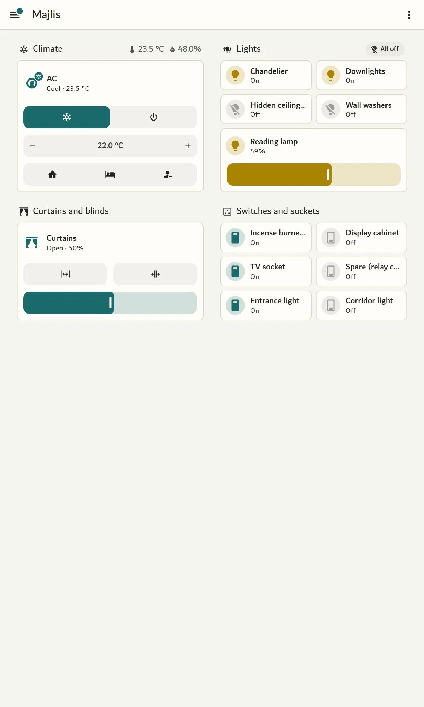
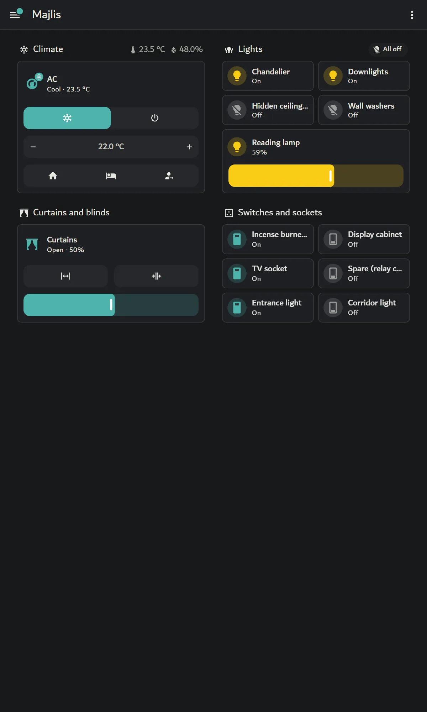
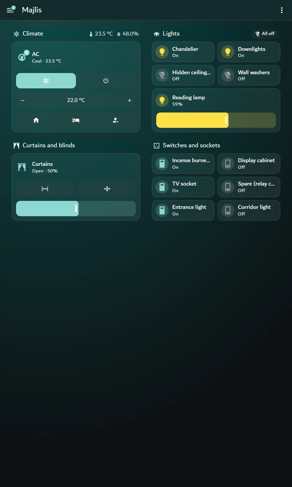
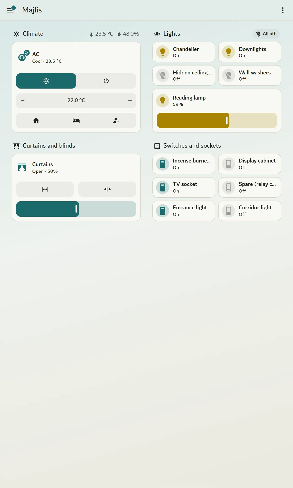
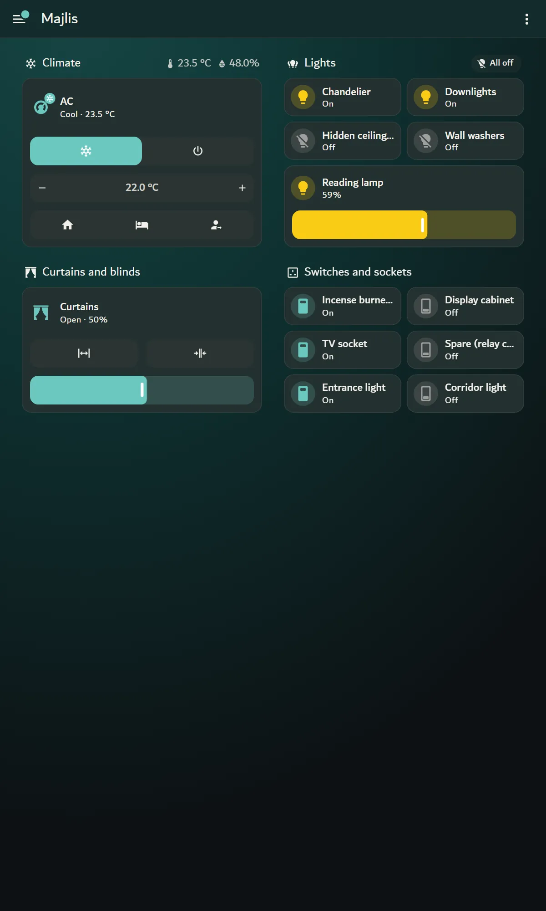
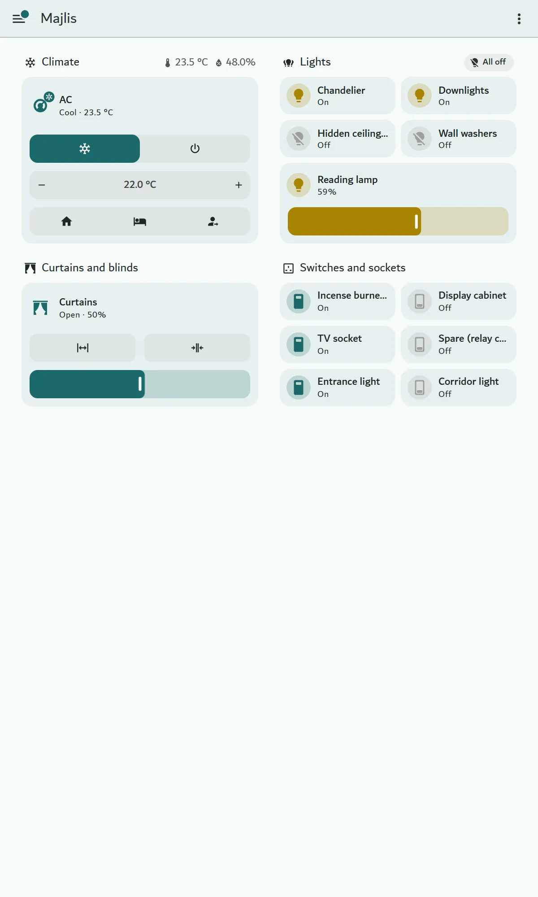
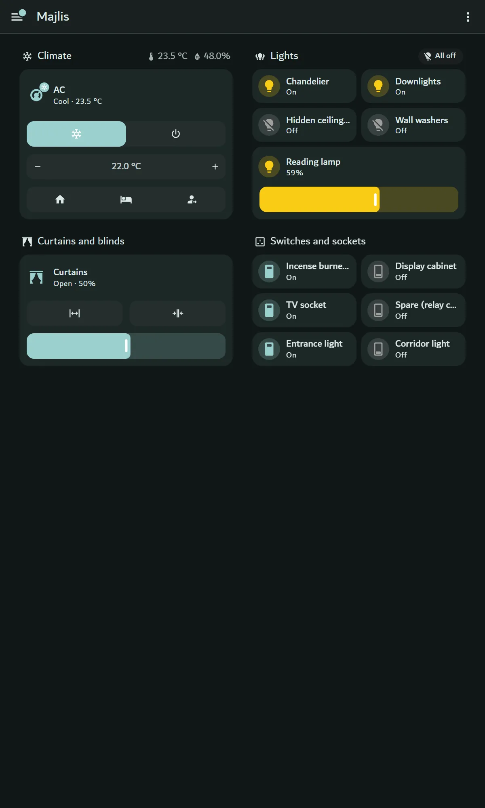
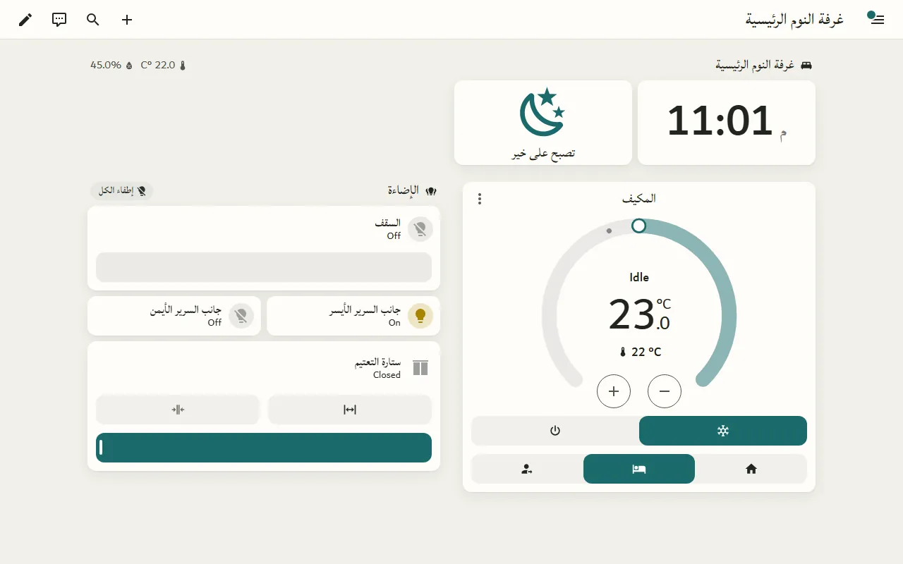

# Dartec theme variants (drafts)

**Status:** drafts for the owner's approval, 2026-09-25. They are proposed in
[kaboomAE/dartec-theme#1](https://github.com/kaboomAE/dartec-theme/issues/1) and **not shipped**. Nothing in
that repository has changed.

| File | What it is |
|---|---|
| [dartec-variants.yaml](dartec-variants.yaml) | All six themes in one file, ready to drop into `dartec-theme/themes/` |
| [contrast.md](contrast.md) | WCAG contrast for every variant, both modes |
| [screenshots/](screenshots/) | Every variant on the bench's real room dashboards |

The analysis behind these drafts is [../design-gallery.md](../design-gallery.md).

## The family

| Variant | Inspired by | In one line |
|---|---|---|
| **Dartec** | Today's Dartec theme | The current theme, corrected: no copper, fonts that load, brand colours on the AC and lights |
| **Dartec Glass** | Frosted Glass, visionOS | Frosted cards over a deep teal ground |
| **Dartec Glass Lite** | the same | Glass without blur or transparency, for cheap wall tablets |
| **Dartec Soft** | iOS Themes | Borderless paper cards, soft elevation |
| **Dartec Material** | Material You | Tonal surfaces generated from the brand teal |
| **Dartec Graphite** | Graphite, Noctis | Quiet neutral surfaces; teal only where something is on. The night theme for bedroom panels |

**What all six share:**

- **Theme variables only.** No card-mod, no JavaScript, no image files, and no
  runtime downloads.
- **Light and dark in one theme,** with both modes fully written. Some
  third-party themes that declare an empty mode vanish from the picker on
  2026.8 (Frosted Glass #141, iOS Themes #110); these do not use that pattern.
- **WCAG AA in both modes** ([contrast.md](contrast.md)).
- **No copper.** It is reserved for AI-generated content. Today's theme uses
  it as its accent, which breaks the brand's rule.
- **Teal for anything interactive**, including the AC's modes. Today they
  stay Home Assistant blue.
- **"Light on" is a gold** (`#a88400` in light modes). It clears 3:1 on every
  card and cannot be mistaken for copper.
- **The same fonts:** Dubai for Latin, Lateef for Arabic, Plex Mono for code.
  They render only once they are loaded (see [Fonts](#fonts)). Until then each
  theme falls back to `system-ui` and Roboto.

## Design briefs

### Dartec

The theme the fleet already runs, corrected. Nothing changes in its look
except the fixes below, so it is the safe first release:

- The accent is teal instead of copper.
- The font variables are ones HA reads (`ha-font-family-*`), replacing the
  `paper-*` variables HA dropped in 2025.5.
- The AC's cool, dry and fan colours are brand teal and a readable gold.
- "Light on" is a readable gold.
- The legacy variables are gone.

| Light | Dark |
|---|---|
|  |  |

### Dartec Glass

**Inspired by:** Frosted Glass (MIT) and visionOS / Liquid Glass (MIT).

**What it keeps:**

- the translucent card over a coloured ground;
- the blur behind each card;
- a soft inner border that catches the edge;
- larger corners (14 px).

**What it changes to fit the brand:**

- **No photograph.** A radial gradient from deep teal (#164645) through dark
  teal to near-black replaces it. It costs no file and no download, and it
  holds contrast.
- **Cards opaque enough to read.** The dark mode is 8% cream over the gradient,
  and the light mode is 62% paper. Every text pair was checked against every
  colour stop of the gradient, taking the worst case.
- **No card-mod.** The glass is `ha-card-background` plus
  `ha-card-backdrop-filter`, which Home Assistant's own card reads.
- **Corners of 14 px**, a deliberate step up from the brand's 8 px. Glass reads
  as glass only when edges are soft.
- **The top bar stays solid.** Blurring it needs UIX.

**Borrowed technique and attribution:**

- The technique (translucent `ha-card-background` with `ha-card-backdrop-filter`
  and an inset border) is Home Assistant's own variable set, and is used the
  same way by both inspirations.
- No value, file or image was copied. Both repositories are MIT, so nothing is
  owed for a technique; if values were ever copied, their copyright notice
  would have to be kept.

| Light | Dark |
|---|---|
|  |  |

### Dartec Glass Lite: the fallback for cheap tablets

The same colours and ground as Glass. The cards are the opaque colour the
glass cards average to (#23302f in dark), and `ha-card-backdrop-filter` is
`none`.

**Use it on:**

- every wall panel, until the panel's own hardware is proven with blur;
- any phone or tablet that feels slow.

Choosing it is a per-person profile setting (themes are per person since
2026.2), so a panel account can have Glass Lite while the family's phones have
Glass. See the measurement below.

| Light | Dark |
|---|---|
|  |  |

### Dartec Soft

**Inspired by:** iOS Themes (MIT).

**What it keeps:**

- cards that float without borders;
- a soft shadow;
- a slightly warmer, friendlier corner (12 px).

**What it changes to fit the brand:**

- **No wallpaper and no translucency.** The iOS set relies on Apple's
  wallpapers, which cannot be shipped.
- **The brand's own two-layer shadow in light mode** (a tight contact shadow
  plus a soft ambient one).
- **A hairline instead of a shadow in dark mode**, as the brand rule says.
- **Cream and paper, not iOS grey.**

| Light | Dark |
|---|---|
|  |  |

### Dartec Material

**Inspired by:** Material You (Apache-2.0).

**What it keeps:**

- tonal surfaces, where every surface is a tone of the brand colour;
- 16 px cards with no border or shadow;
- pill-shaped controls.

**What it changes to fit the brand:**

- **The palette is generated from Dartec teal #1A6B6B** with the Material 3
  "tonal spot" scheme, using
  [materialyoucolor](https://github.com/T-Dynamos/materialyoucolor-python)
  3.0.4 (MIT), a port of Google's
  [material-color-utilities](https://github.com/material-foundation/material-color-utilities)
  (Apache-2.0). Generated colour values are output, not copied work.
- **The dark ground is lifted from Material's #0a0f0f to #111717**, because the
  brand never uses near-black.
- **No `material-you-utilities` JavaScript.**

| Light | Dark |
|---|---|
|  |  |

### Dartec Graphite

**Inspired by:** Graphite (MIT) and Noctis. Noctis has no licence, so nothing
from it is reused; we only looked at it.

**What it keeps:**

- near-neutral surfaces;
- one accent;
- flat, bordered cards;
- a calm, low-light dark mode.

**What it changes to fit the brand:**

- **Warm graphite** rather than cool grey.
- **Teal instead of Graphite's orange.** Graphite's light accent fails
  contrast (2.38:1).
- **The brand's 8 px corners.**
- **Grey icons when a device is off, teal only when it is on**, so a dark
  bedroom panel shows colour only where something is running.

| Light | Dark |
|---|---|
|  |  |

### Not made

- **LCARS**: about 80% of that look is injected CSS; it cannot mirror for
  Arabic; and it is licensed for personal use only.
- **A Catppuccin-style pastel set**: its method (one palette, several
  flavours) is what Dartec Material does with the brand teal, and pastels are
  not calm. Both are covered in the [design gallery](../design-gallery.md).

## Contrast

Every variant passes WCAG AA in both modes, with no exceptions. Text and
secondary text are at least 4.5:1 on cards and on the page. The accent, the
AC mode colours and "light on" are at least 3:1 on cards. For translucent
cards, the figure is the worst case over every colour of the background
gradient. Full table: [contrast.md](contrast.md).

The first Glass draft failed in dark mode. Where the card sat over the
lightest part of the teal gradient, secondary text fell to 3.91:1 and the
accent to 3.34:1. The gradient was deepened and the dark-mode text and
accents lightened until the worst case passed (6.09 and 5.30).

## Cost on a cheap wall tablet

What we measured on the bench's home overview (phone size, which scrolls
897 px):

- **Browser:** Chromium in a visible window with the **GPU disabled**, so every
  pixel is drawn by the CPU, a stand-in for a weak tablet GPU. The CPU was
  **throttled 4×**.
- **Scroll:** real mouse-wheel scrolling.
- **Recorded:** frame intervals, and Chromium's own trace of drawing work.
- **Runs:** each figure is the median of three.

| Theme | Drawing work during the scroll | Frames drawn | 95th-percentile frame | Frames over 33 ms |
|---|---|---|---|---|
| HA default | 610 ms | 223 | 13.9 ms | 0 |
| Dartec | 591 ms | 230 | 7.0 ms | 0 |
| **Dartec Glass** | **6,542 ms** | **149** | **27.7 ms** | 1 |
| Dartec Glass Lite | 689 ms | 217 | 13.9 ms | 0 |

What this shows:

- **Blur multiplies the drawing work by about eleven.** The browser also drops
  about a third of the frames to keep up.
- **Glass Lite, with the same gradient ground, costs the same as an opaque
  theme.** The gradient is not the expensive part; the blur is.

What it cannot show:

- **The real tablets.** The Galaxy Tab A7 and the NSPanel Pro have real, if
  modest, GPUs, and how they compare with this PC drawing in software is not
  known. The direction is certain (blur is the costly part); the size of the
  effect on a real panel is not.
- A run on the Tab A7 (Chrome's remote debugging over adb) is the next step,
  and we could not reach the tablet from here. Until then, **wall panels get
  Glass Lite**.

Headless Chromium, the method we tried first, skips drawing frames entirely
and so shows no difference at all. We note this because it is an easy way to
reach the wrong conclusion.

## Fonts

**The brand's faces are Dubai (Latin), Lateef (Arabic) and IBM Plex Mono
(figures).** The web files are in `smarthome-planner/assets/fonts/`, 278 KB
for all seven.

A theme can name a font but cannot load one. A theme variable cannot hold
`@font-face` or the files. On the bench we loaded the fonts in the test
browser only, served from the local repository, and the themes' font
variables picked them up in every Home Assistant component, including
right-to-left. See any `-ar` screenshot.



**What worked:**

- **Lateef restricted to Arabic** with `unicode-range`, and
  **`size-adjust: 150%`**. That is the storefront's own rule, and it removes
  the "Lateef is too small" problem found earlier ([../arabic-rtl.md](../arabic-rtl.md#fonts)).
  Arabic now reads at the same size as the Dubai beside it.
- **Dubai at `size-adjust: 113%`**, as the storefront sets it. Latin text
  inside Arabic ("Off", "Idle", the clock) stays in Dubai.

The `@font-face` rules used on the bench:

```css
@font-face { font-family: "Dartec Dubai"; font-weight: 400; src: url(".../dartec-dubai-400.woff2") format("woff2"); size-adjust: 113%; }
@font-face { font-family: "Dartec Lateef"; font-weight: 400; src: url(".../dartec-lateef-400-ar.woff2") format("woff2");
             size-adjust: 150%; unicode-range: U+0600-06FF, U+0750-077F, U+08A0-08FF, U+FB50-FDFF, U+FE70-FEFF; }
@font-face { font-family: "Dartec Plex Mono"; font-weight: 500; src: url(".../dartec-plex-mono.woff2") format("woff2"); }
```

(The 500 and 600–700 weights follow the same pattern.)

**What it takes in a real home**, in the order we would choose:

1. **The agent serves the fonts and the `@font-face` rules** from its own
   static path. It already serves the brand SVGs and loads
   `dashboard-fix.js` into every page. Cost: 278 KB in the agent package,
   downloaded once per browser and cached. The fonts then work on every page,
   not only on dashboards. This is agent code, so it needs the owner's
   approval.
2. **A dashboard resource** (a CSS file in `config/www`). No agent change, but
   it applies only on dashboard pages and needs a file written into each home.

**Licences:**

- **Lateef** and **IBM Plex Mono** are under the SIL Open Font License 1.1.
  They may be bundled, provided the OFL text goes with them.
- **Dubai** is under its own end-user licence from the Government of Dubai,
  and the agent's repository is **public**. Bundling Dubai there would publish
  the font files to anyone. **Read Dubai's licence before choosing option 1.**
  If it does not allow redistribution, serve Dubai from the private manager
  instead, or use a system Latin font in HA.

**What shipped (R15, dartec-ha-manager#59, approved 2026-09-26):** option 1,
without Dubai. The agent serves Lateef (400, 500, 600–700) and IBM Plex Mono
Medium from `/dartec_branding/fonts/` and declares them from
`dashboard-fix.js`, with the rules above: Lateef Arabic only, at 150%.

- **Dubai is left out.** Its EULA (The Executive Council of Dubai) grants a
  "non-transferable, non-sublicensable" licence for the licensee's "own
  personal or internal business purposes only" (2.2), forbids anyone to
  "further distribute (whether commercially or otherwise)" it (3.1(d)) or
  "make available, the Font Software in any form … to any person without the
  prior written consent of TEC" (3.1(i)). A public repository cannot meet
  that. Serving it from the manager instead does not clearly meet it either:
  web use must be "in a secure manner which does not allow an End User to
  access the Font Software outside of the Digital Product" (2.2(e)), and a
  font file handed to a browser can be saved. Dubai needs TEC's written
  consent (info@dubaifont.com, clause 8.1).
- **The storefront's web files are not used.** They are subsets that keep the
  names "Lateef" and "Plex", which both fonts reserve, and the OFL does not
  let a modified font keep a reserved name (condition 3; a subset is a
  modification, OFL FAQ 2.6). The agent ships the unmodified fonts instead:
  SIL's Lateef compressed to WOFF2 and nothing else (OFL FAQ 2.2.1), and IBM's
  own Plex Mono web file. About 290 KB, fetched only on pages whose theme
  names these families, Lateef only when Arabic is on the page. Details and
  hashes: `custom_components/dartec_ha_manager/www/fonts/README.md`.
- **The theme's stack** should read, until Dubai is licensed:
  `ha-font-family-body` and `ha-font-family-heading`:
  `"'Dartec Lateef', system-ui, Roboto, sans-serif"`;
  `ha-font-family-code`: `"'Dartec Plex Mono', 'IBM Plex Mono', ui-monospace, monospace"`.
  The drafts below still name `'Dartec Dubai'` first; with no such face
  declared, browsers skip it, so they render the same.

**What a theme cannot do with fonts:**

- **Arabic line height.** The brand asks for +18% on Arabic lines. HA's
  line-height variables are global, not per script. The injected stylesheet
  could raise them when the page is in Arabic; that is untested.
- **Figures in Plex Mono.** HA draws figures in the body font. Tabular figures
  would need `font-variant-numeric`, which no theme variable sets.
- **Heavier Arabic weights.** Only the three weights above exist.

## What we recommend shipping first

1. **Dartec (corrected) first.** It changes nothing about how homes look today
   while fixing the brand errors: copper as the accent, fonts that never load,
   and blue AC controls. It is the lowest-risk release, and every home already
   runs this theme.
2. **Dartec Graphite second, as the panel theme.** It is calm, cheap to draw,
   easy to read at night, and it shows teal only where something is on. It is
   the natural default for bedroom and maid's-room panels, which today use
   whatever the house's default theme is.

**Glass (with Glass Lite as its partner) is the premium option to offer
once the fonts ship.** It is the most distinctive look and still passes AA,
but it should not go on a wall panel until blur has been measured on the real
Tab A7.

**Soft and Material are good, and add little over Dartec and Graphite.** Keep
them as choices a customer can pick.

## How these were tested

The draft themes could not be installed on the bench as files:

- Home Assistant has no API for writing theme files.
- HACS installs only from a GitHub repository.
- `kaboomAE/dartec-theme` was not to be changed yet.

So each draft was handed to **Home Assistant's own frontend theme code in the
test browser**, as if the server had sent it. It was added to the frontend's
list of themes, made the default, and applied by the frontend's own
`_applyTheme`, with light and dark modes and all.

To prove this is faithful, we installed the real Dartec theme v1.1.0 through
HACS, pinned, and rendered it both ways. The screenshots were **pixel-identical,
in light and dark: 0 of 2.4 million pixels differed.**

**What changed on the bench:**

- the test villa, rebuilt;
- the prototype dashboards;
- Dartec theme v1.1.0 from HACS, for the validation.

All three were removed afterwards, and every changing call is in
[../prototypes/bench-log-variants.jsonl](../prototypes/bench-log-variants.jsonl).
The Arabic screenshots use the browser's own language setting, so the bench
account's language was not changed this time.
