# Layout: how a Dartec home's dashboards should be built

The structure below was tested on the bench (HA 2026.9.3) against a test villa
with two floors and seven rooms. Every screenshot is ours, taken from the bench.
The exact YAML of each dashboard is in [prototypes/](prototypes/). Screenshot
names follow `<dashboard>-<size>-<light|dark>-<en|ar>.webp`. The sizes are:

- **phone**: 390 × 844
- **tablet**: 800 × 1333, which is the Galaxy Tab A7 in portrait
- **wall**: 1280 × 800
- **nspanel**: 480 × 480

## What the manager generates today

Room dashboards (`dartec-room-<slug>`) come from the manager's
`server/app/room_dashboards.py`. Each is one `sections` view per room. It uses
built-in cards only:

- a `heading` per group, then `tile` cards
- groups in a fixed order: scenes, lights, climate, covers, media, switches,
  security, sensors, cameras
- at most 24 tiles per group

The whole-home "Dartec Home" blueprint (`blueprint.py`) is also built-in cards
only. Dwains Dashboard Next is offered as an alternative from the dashboard
catalogue.

We ran that exact generator (manager `main`, commit `5935326`) over the test
rooms and pushed its output to the bench. The YAML is in
[prototypes/today-generator.en.yaml](prototypes/today-generator.en.yaml). What we
saw:

| | Today | Why it matters |
|---|---|---|
| **Order** | Lights, then climate | In a UAE villa the AC is the control people use most. It should be first on the phone, which shows sections in order |
| **Climate** | The AC tile has only a temperature stepper. Room temperature and humidity are separate tiles next to it | You cannot switch the AC off or change its mode from the tile. The two sensor tiles repeat what the AC tile already shows |
| **Names** | Each tile shows HA's full name: "Majlis chandeli…", "Majlis downlig…", "SONOFF 4CHP…" ×4, "Aqara Wall Swi…" ×2 | The room's name is repeated on every tile and the part that matters is cut off. The four relay channels cannot be told apart |
| **Crowded room** | The guest suite has 26 circuits. The dashboard shows 24, and every one reads "East guest suit…" | Two circuits vanish without a word, and the other 24 are indistinguishable |
| **Offline device** | The kids' room light and air-quality sensor are offline, and they are not on the dashboard at all | The family sees a room with no light and no reason. Staff cannot tell a broken light from one that was never installed |
| **Leak sensor** | Filed under "Doors and security" | A water leak is a safety alarm, not a door |
| **Arabic** | English names in an Arabic layout lose their beginning: "…jlis wall washers" | The part of the name that says what it is is the part that is cut |

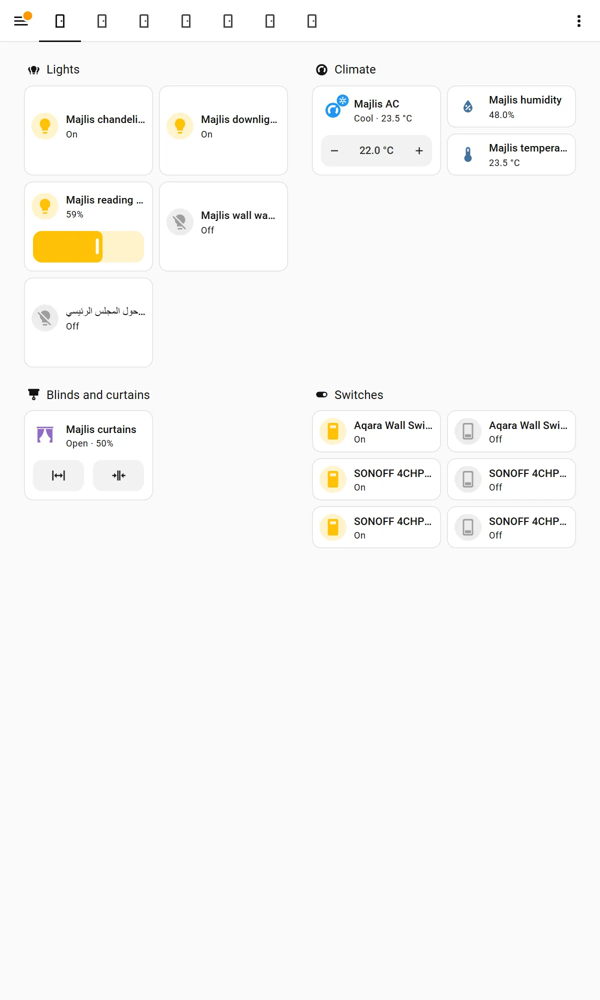

Today's generator is on the left and the prototype on the right. The prototype
puts climate first and gives the AC real controls. The room's temperature and
humidity move to the heading, and the names are short and readable.

## The recommended structure

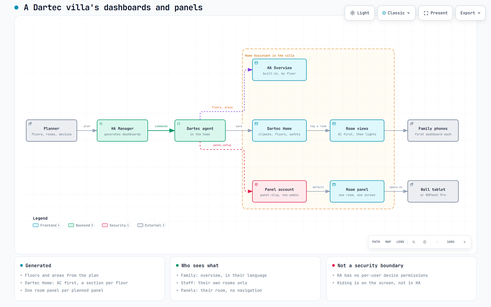

The interactive version of this diagram is
[diagrams/dashboard-map.html](diagrams/dashboard-map.html).

### 1. Home overview (one per household language)

[prototypes/home-overview.en.yaml](prototypes/home-overview.en.yaml) and
[.ar.yaml](prototypes/home-overview.ar.yaml).

One `sections` view with `max_columns: 3`, in this order:

1. **Climate.** One tile per AC, named after the room (`name: Majlis`, not
   "Majlis AC"). Each tile shows the current temperature and mode
   (`state_content: [state, current_temperature]`) and a target-temperature
   stepper. The heading carries one button: **All ACs off**, with a
   confirmation, because it changes every room at once.
2. **One section per floor.** The floor's name as the heading, then an
   `area` card per room (`display_type: compact`). Each card has a light
   control (`area-controls`) and taps through to the room's subview.
3. **Safety.** The leak sensor, then an `entity-filter` card titled
   **Needs attention**. It lists every device in the house that is currently
   unavailable, and disappears when nothing is (`show_empty: false`).

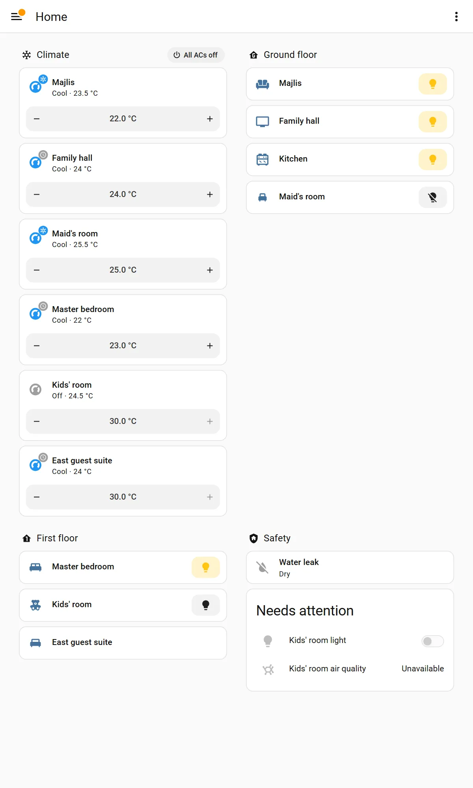
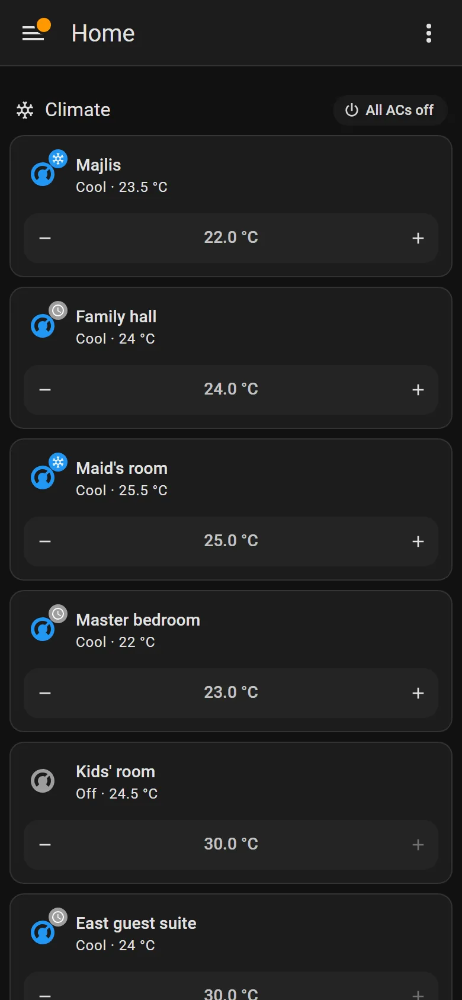

What we learned:

- **The phone shows sections in order.** Six AC tiles fill the first phone
  screen before a single room appears. For a family that uses AC all day,
  that is arguably right. For a larger villa (10+ ACs) it is not. Either give
  the phone compact AC tiles without the stepper, using `visibility` with a
  `screen` condition, or list only the ACs that are running (an
  `entity-filter` on `state: cool`). Decide per household size.
- **Compact area cards did not show the room temperature**, although each
  test room had its temperature sensor set in the area's settings. HA's own
  Overview does show it (below). If the overview's room cards should carry
  temperature, use the area card's larger display types, or rely on the
  Climate section.
- **HA's own "Overview" (the Home dashboard, default for new installs since
  2026.2) is a good free baseline.** It groups rooms by floor, shows each
  room's temperature, adds summaries (climate range, lights on, repairs) and
  keeps itself up to date. It is only as good as the area and floor
  assignments. The manager's "apply plan structure" (Phase 2) already creates
  those, so every Dartec home gets a usable Overview for free. Our dashboards
  should add to it, not replace it.

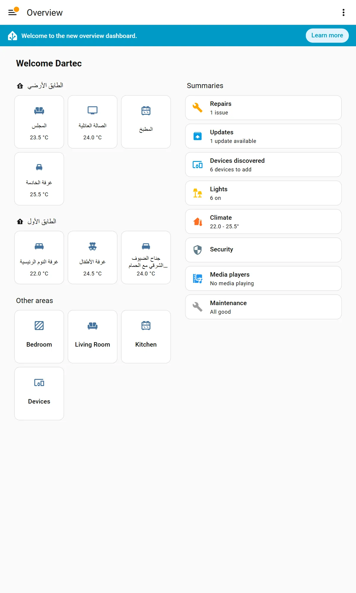

### 2. Room views

One subview per room (`subview: true`, `back_path` to the overview), with
`max_columns: 2`. The same sections are used for a stand-alone room dashboard
([prototypes/room-majlis.en.yaml](prototypes/room-majlis.en.yaml)). The order is
fixed, and a section only appears when the room has something for it:

| Section | Cards | Notes |
|---|---|---|
| **Climate** | One AC `tile` at full width with `climate-hvac-modes` (cool, dry, fan_only, off, filtered to what the unit supports), `target-temperature`, and `climate-preset-modes` where the unit has presets | The heading carries the room's temperature and humidity as entity badges instead of separate tiles |
| **Lights** | `tile` per light, half width. Dimmable lights get `light-brightness` and full width | The heading carries **All off** (a button badge that calls `light.turn_off` on the area) |
| **Curtains and blinds** | `tile` with `cover-open-close` and `cover-position` | |
| **Switches and sockets** | `tile` per switch, half width | Each channel of a relay is named by what it powers |
| **Sensors** | Leak, motion, air quality, and so on | Temperature and humidity are left out, because they are in the Climate heading |

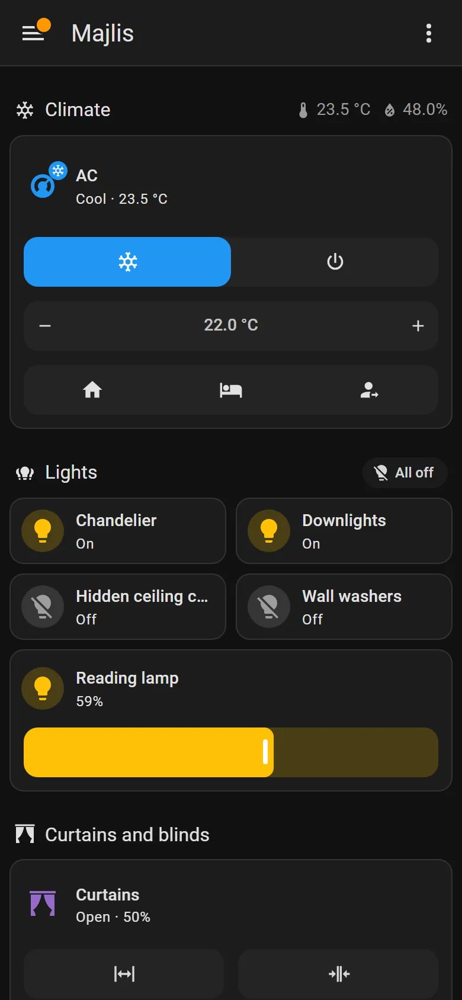
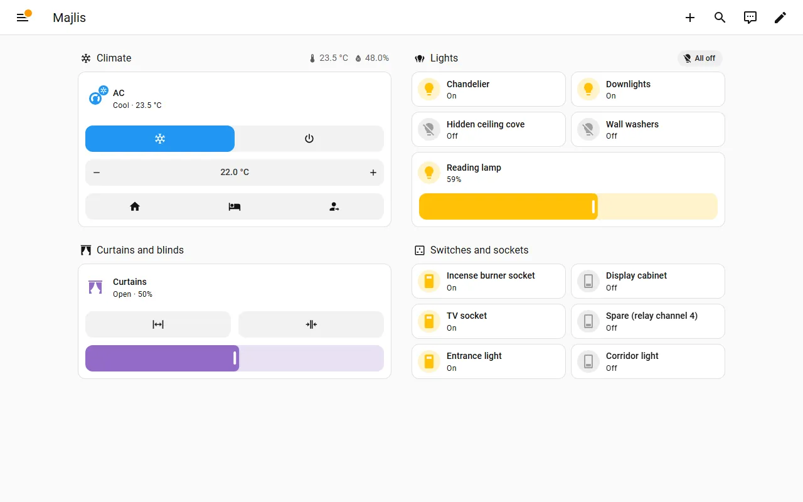

### 3. Floors

Floors are headings on the overview. Each floor does not need its own view
until a floor has more than about eight rooms. At that size, make one view per
floor (views are tabs, so the floors sit side by side at the top). HA's own
Lights, Climate and Security dashboards are grouped by floor and area already.

### 4. Climate, security and energy

- **Climate** is the first section of the overview and of every room. A
  separate climate view is not needed. HA's built-in Climate dashboard already
  lists every AC by floor.
- **Security**: HA's built-in Security dashboard (2026.9 added active alerts
  and favourites) is the place for locks, alarm and cameras. Show only
  **safety alarms** on the family overview: leaks, smoke, gas. Do not put a
  map of open windows or camera feeds on shared screens that domestic staff and
  visitors see. This rule comes from the cloudapp.dev alarm article and holds
  twice over in a villa with staff.
- **Energy**: only if the home has metering (a smart meter with a Home
  Assistant integration, a CT clamp, solar). Otherwise leave it out. The built-in Energy dashboard is
  enough.

## Navigation

- **Overview → room → back.** Area cards navigate to the room's subview, and
  the subview's back arrow returns to the overview. No tabs for rooms: a villa
  with 20 rooms makes an unusable tab bar. Today's generator output shows this,
  since it has one tab per room with icons only.
- **Floors as headings, or as tabs at scale.**
- **Panels do not navigate.** A room panel shows its own room only
  ([panels.md](panels.md)).
- **Paths:** ASCII, lowercase, never starting with a digit (HA reads a
  leading digit as a view index). Use `room-majlis`, not the Arabic name.

## Card choices

| Use | Card | Minimum HA |
|---|---|---|
| A device you control | `tile` with the right `features` | 2023.x (features 2024–2026) |
| A section title and its room-level actions | `heading` with entity and button badges | 2024.10 (button badges 2026.2) |
| A room on the overview | `area` (`display_type: compact`, `area-controls`) | 2025.7 |
| A big AC dial on a panel | `thermostat` | long-standing |
| The time on a panel | `clock` | 2025.4 |
| A one-tap scene ("Good night") | `button` with `perform-action` `scene.apply` | long-standing |
| "Needs attention" | `entity-filter` over `state: unavailable`, `show_empty: false` | long-standing |
| Hide or show by screen or person | `visibility` with `screen` or `user` conditions | 2024.6 |

## What to avoid

- **Custom cards, card-mod and dashboard strategies from HACS** on customer
  homes (see [maintenance.md](maintenance.md)). Everything above is built in.
- **Markdown cards as headings.** They take a grid cell and push tiles into
  the wrong columns (five-steps guide). Use `heading`.
- **Vertical, compact tiles for long names.** On the bench they made the
  crowded suite worse: "East guest su…" instead of "East guest suit…".
- **Icon-only choices without an obvious icon.** AC presets as three icons
  (house, bed, person with arrow) do not explain themselves. Use
  `style: dropdown`, which shows words, or a `button` card with a name for the
  one preset that matters ("Good night").
- **Actions in heading badges when they are the main action.** Badges are
  about 24–28 px tall, below touch-target guidance, and on a phone a heading
  with three badges pushes the last one off-screen. That is what happened to
  "Good night" on the first panel prototype.
- **Dropping devices that are offline.** Show them. The tile says
  "Unavailable" and HA marks the icon.
- **Silent limits.** If a section must be capped, say how many more there are
  and link to them.
- **Views without `type: sections`.** A view with `cards:` and no `type`
  becomes masonry.

## Crowded rooms, offline devices and odd names

**26 circuits in one room.** Today the dashboard shows 24, all reading
"East guest suit…". The prototype removes the room's name from the front of
each name ("Circuit 01 (ceiling downlights near the window)") and shows all 26.
The names are still cut at half width. The real fix is short names from the plan,
not a different card.

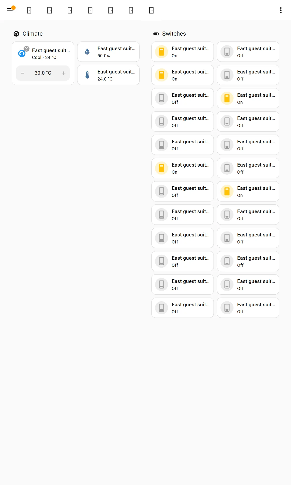
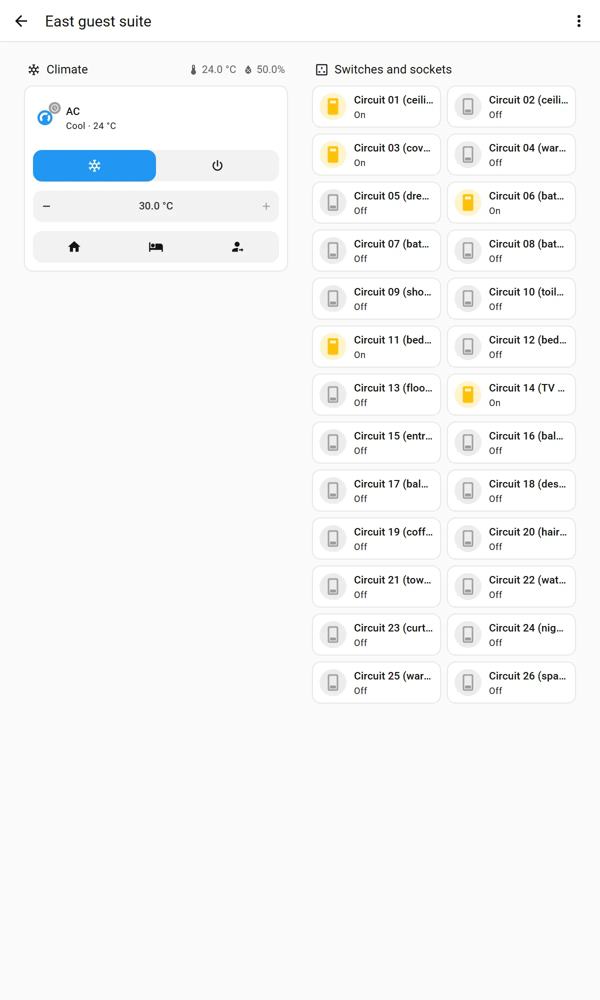

**A device offline.** Today it is dropped. The prototype shows it as
"Unavailable" with HA's warning mark, and lists it under **Needs attention**
on the overview.

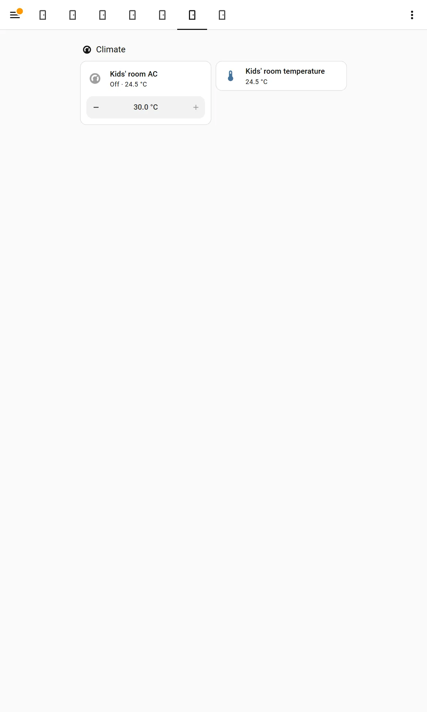
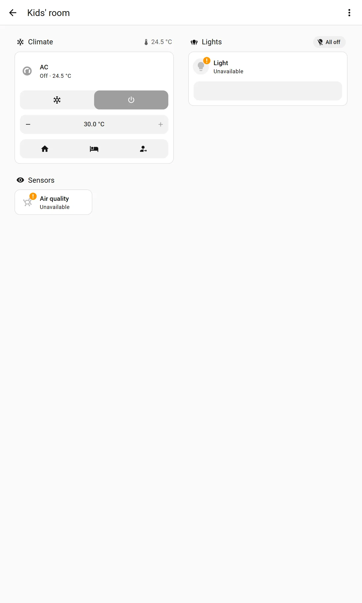

### Multi-channel devices

A Sonoff 4CH relay appears in HA as four switches named "SONOFF 4CHPROR3
Switch 1" to "4". An Aqara H1 dual wall switch appears as "Left" and "Right".
Nothing in HA says which circuit each one drives. The planner catalogue cannot
say it either: it has no channel or gang field, and `qty` counts identical
units, so a 2-gang switch is one line. So the dashboard can only show "Switch
3".

The prototype names each channel by what it powers ("Incense burner socket",
"Display cabinet", "TV socket", "Spare (relay channel 4)"). Those names have to
come from somewhere: either a person types them during commissioning, or the
plan says, per channel, which circuit it is. See recommendation R9.

## Minimum Home Assistant versions

The prototypes use features from these releases. Every Dartec home should be
on 2026.2 or later. The fleet's guarded updates keep homes current.

| Feature | Since |
|---|---|
| `max_columns`, floors | [2024.4](https://www.home-assistant.io/blog/2024/04/03/release-20244/) |
| `visibility` conditions (screen, user) | [2024.6](https://www.home-assistant.io/blog/2024/06/05/release-20246/) |
| `column_span`, full-width cards | [2024.9](https://www.home-assistant.io/blog/2024/09/04/release-20249/) |
| `heading` card | [2024.10](https://www.home-assistant.io/blog/2024/10/02/release-202410/) |
| Area temperature/humidity setting, `clock` card | [2025.4](https://www.home-assistant.io/blog/2025/04/02/release-20254/) |
| Redesigned `area` card, `area-controls` | [2025.7](https://www.home-assistant.io/blog/2025/07/02/release-20257/) |
| `name: {type: entity}` | [2025.11](https://www.home-assistant.io/blog/2025/11/05/release-202511/) |
| Per-user default dashboard | [2025.12](https://www.home-assistant.io/blog/2025/12/03/release-202512/) |
| Heading button badges, per-user themes, Home dashboard as default Overview | [2026.2](https://www.home-assistant.io/blog/2026/02/04/release-20262/) |
| Section background, auto height | [2026.4](https://www.home-assistant.io/blog/2026/04/01/release-20264/) |
| All inline features shown, climate `target-humidity` | [2026.9](https://www.home-assistant.io/blog/2026/09/02/release-20269/) |

## Every screenshot

The prototypes were tested in all combinations: phone, tablet and wall, light
and dark, English and Arabic. Today's generator and HA's Overview were tested
the same way.

| Dashboard | Files in `screenshots/layouts/` |
|---|---|
| Today's generator, majlis | `today-majlis-{phone,tablet,wall}-{light,dark}-{en,ar}` |
| HA's Overview | `ha-overview-{phone,tablet,wall}-{light,dark}-{en,ar}` |
| Prototype home overview | `proto-home-{phone,tablet,wall}-{light,dark}-{en,ar}` |
| Prototype room (majlis) | `proto-room-{phone,tablet,wall}-{light,dark}-{en,ar}` |
| Prototype bedroom panel | `proto-panel-{phone,tablet,wall,nspanel}-{light,dark}-{en,ar}` |
| Crowded suite, today and prototype | `today-suite-tablet-light-{en,ar}`, `proto-suite-tablet-light-{en,ar}` |
| Offline room, today and prototype | `today-kids-tablet-light-{en,ar}`, `proto-kids-tablet-light-{en,ar}` |
| Maid's room on a phone | `proto-maid-phone-light-{en,ar}` |

A note on these screenshots: they were taken as the bench's **Dartec admin**
account. That is why the wall-size shots show the edit, search and assist
icons. A panel account is not an administrator, so it does not see the edit
pencil.
