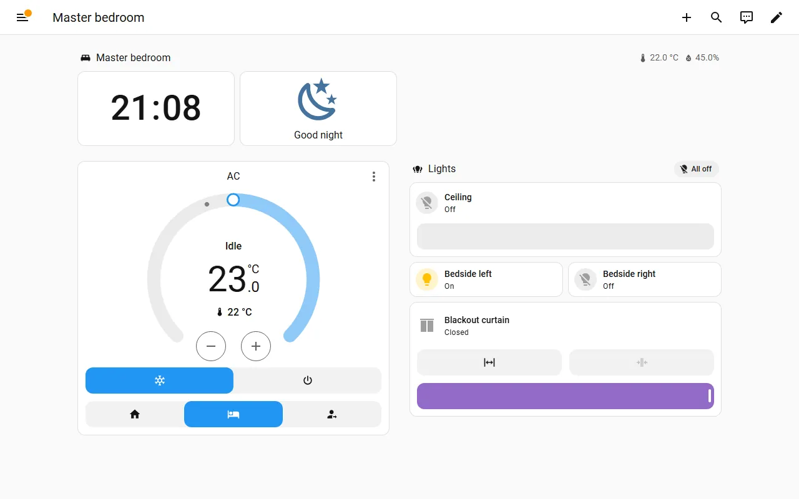
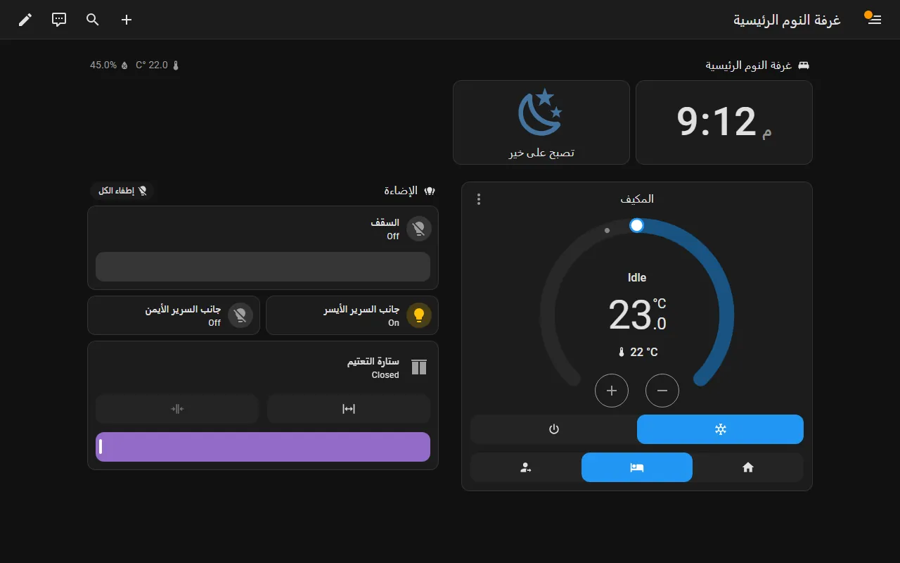
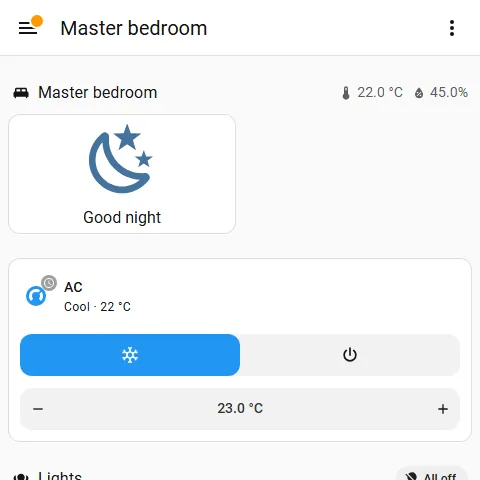

# Wall panels: Android tablets and the Sonoff NSPanel Pro

A room panel is a screen fixed to a wall in one room. It is signed in as its
own Home Assistant account and opens on that room's dashboard. Agent 0.23.0
creates the account (`panel_setup`). The manager publishes the room's
dashboard, and the onboarding apps walk the technician through the tablet.

What already exists and has been proven is written up elsewhere. This page
does not repeat it:

- the agent's side: [HANDOVER.md §6](../../HANDOVER.md#6-command-surface), `panels.py`, `panel_cmds.py`
- the manager's side: dartec-ha-manager-server `docs/23-room-panels.md`
- the technician's steps, and the Galaxy Tab A7 run of 2026-09-20: dartec-onboarding `docs/panels.md`

This page is about **what a panel should show and how it should behave**.

## How a panel maps to a room

| Plan | Home Assistant | Panel |
|---|---|---|
| A planned device whose category has `panel_kind` (`android_tablet` or `nspanel_pro`), placed in a room | The room is an HA area, created by the manager's "apply plan structure" | One `panel-<slug>` account: not an administrator, local network only, no person. Its first dashboard is the room's dashboard, and every other sidebar entry is hidden |

- **One panel, one room.** A panel never navigates to other rooms. The room
  dashboard deliberately has no links out (`room_dashboards.py`). If a family
  wants a whole-house panel in the entrance hall, that is a different kind of
  panel with a different dashboard. It is not a room panel with navigation
  added.
- **Two panels in one room** (a big majlis) share one dashboard and have two
  accounts.
- **A moved panel** follows `panel_update` with a new `url_path`. The
  1Password item still names the room it was set up in.
- **It is not a security boundary.** Home Assistant cannot limit an account to
  one room's devices, so anyone who knows a panel's password can control the
  whole house through the API. The screen hides the rest of the house; nothing
  in HA stops it. The apps and My Home already say so. Keep saying it.

## What a panel dashboard should look like

The prototype is [prototypes/panel-master-bedroom.en.yaml](prototypes/panel-master-bedroom.en.yaml)
(and [.ar.yaml](prototypes/panel-master-bedroom.ar.yaml)). It is a room view,
reshaped for a fixed screen:

1. **A heading** with the room's name, temperature and humidity.
2. **The clock** and **one big "Good night" button**, side by side. The button
   is a `button` card. It runs `scene.apply` in one tap: every light in the
   room off, the blackout curtain closed, and the AC on cool with the Sleep
   preset. Changing it needs no helper and no script in the home.
3. **The AC as a thermostat dial**, large enough to use from across a
   bedroom, with mode and preset buttons.
4. **Lights and curtains** as tiles, with **All off** in the lights heading.

It fits a 1280 × 800 landscape tablet with no scrolling. It took three
iterations on the bench to get there, and each change is a rule:

| Iteration | What went wrong | Rule |
|---|---|---|
| 1 | The clock filled only half the width | In a section spanning two columns, a card needs `columns: full` or it takes half |
| 1 | On a phone, "Good night" as the third heading badge ran off the screen ("Good n…") | The main action is a card, not a badge. Heading badges do not wrap, and they are about 24–28 px tall |
| 2 | Clock, button and dial stacked were taller than 800 px, so the dial was cut off | Put the clock and the main action side by side. A fixed panel must fit one screen |
| 2 | On the NSPanel's 480 × 480 the clock took most of the screen and the AC was below it | `visibility` with `screen: (min-width: 600px)` on the clock and the dial. On small screens a compact AC tile replaces the dial |

### What a bedroom panel should show, and what it should not

| Show | Do not show |
|---|---|
| This room's AC, lights, curtains | Other rooms, the house overview |
| One "Good night" action, and one "Good morning" if the family wants it | Cameras, door locks, the alarm, a list of open windows |
| Temperature and humidity in the room | Energy, batteries, updates, anything that needs a decision |
| The time | Notifications for the whole house |

The reasons: a bedroom is private; a child's panel should not open the front
door; staff and guests use some bedrooms; and at night a screen should give
light and one action, not information. A **maid's room** panel follows the same
rule. It shows that room only. Whether domestic staff should control their
own room's AC from a panel is the family's decision to make at handover, not a
default.

## Kiosk set-up (what Home Assistant offers, and what it does not)

| Need | Android tablet (Companion app) | Sonoff NSPanel Pro | Source |
|---|---|---|---|
| Open on the room | The account's first dashboard (agent) plus "Always show first view on app start" | The same, if the Companion app runs (unconfirmed) | [web view settings](https://companion.home-assistant.io/docs/integrations/android-webview), [default dashboard](https://www.home-assistant.io/dashboards/dashboards/) |
| Start at boot, Home button returns to HA | "Use as Home app (launcher)" | Needs sideloading; eWeLink's launcher may take the screen back | [launcher](https://companion.home-assistant.io/docs/integrations/android-home-app-launcher) |
| Hide the sidebar | "Always hide the sidebar" on the panel's profile. It is kept per browser, so it is set on the tablet itself | The same | [user settings](https://www.home-assistant.io/docs/configuration/user-configuration/) |
| Hide HA's own toolbar and edit button | **Not on Android.** HA's kiosk flag is set only by the iOS Companion app (kiosk mode, 2026.7+ with a Labs feature). A `?kiosk` URL belongs to the third-party HACS project kiosk-mode, which we do not install | Not available | [iOS kiosk mode](https://companion.home-assistant.io/docs/integrations/ios-kiosk-mode) |
| Keep the screen on | "Keep screen on" (while the app is in front) | Needs automations | [web view settings](https://companion.home-assistant.io/docs/integrations/android-webview) |

Because a panel account is not an administrator, it does not see the edit
pencil. On the bench's admin screenshots it appears, and on a real panel it
does not. The hamburger button stays. Removing it would need HACS.

## Screen, brightness and waking at night

Android's Companion app accepts commands sent as notifications to the panel's
own `notify.mobile_app_<tablet>` service. With **local push** on, they work
without internet and without the daily notification limit
([notification commands](https://companion.home-assistant.io/docs/notifications/notification-commands/)):

| Command | Use on a panel |
|---|---|
| `command_screen_brightness_level` (0–255) | Dim the bedroom panel at night (e.g. 10 after 22:00), brighten it in the morning |
| `command_auto_screen_brightness` | Turn Android's auto-brightness off, so a scheduled level sticks |
| `command_screen_off_timeout` (ms) | A short timeout at night, a long one in the day |
| `command_screen_on` (with `keep_screen_on`) | Wake the panel when someone walks in |
| `command_webview` | Send the panel back to its room (`/dartec-room-bedroom/room`) |

There is **no documented `command_screen_off`**. At night, lower the
brightness and shorten the timeout rather than switching the screen off.

The tablet's own sensors can drive these automations
([companion sensors](https://companion.home-assistant.io/docs/core/sensors)).
Set the sensor update frequency to **"Fast While Charging"**: a wall panel is
always charging, and the default is every 15 minutes.

- the **light sensor**, for a dark room: dim
- the **proximity** or **interactive** sensor, for someone in front of the panel: wake
- **is charging**, so a panel that has lost power raises an alert

**Fully Kiosk Browser** can switch the screen off and on, run a screensaver,
and wake on motion, all through an official integration
([Fully Kiosk](https://www.home-assistant.io/integrations/fully_kiosk/)).
It needs a paid Fully Plus licence per device, and it replaces the Companion
app with a browser. Keep it as the documented fallback for tablets where the
Companion app's launcher mode does not hold.

**Recommended night behaviour for a bedroom panel** (automations, generated per
room panel; not built yet, see R5):

- 22:00, or when the room's light sensor falls below 5 lx: brightness 8,
  screen timeout 15 s.
- Someone approaches (proximity or interactive): the screen comes on at that
  brightness, never full.
- 06:00, or when the curtain opens: auto-brightness back on, timeout 2 min.
- Always: after 2 minutes on another page, `command_webview` back to the room.

## Touch targets and distance

- The sections grid row is 56 px tall with an 8 px gap
  ([developer docs](https://developers.home-assistant.io/docs/frontend/custom-ui/custom-card/)),
  so a one-row tile or feature button is about 56 px, which is comfortable.
  Mode buttons in a tile feature are about 40–48 px on a tablet.
- **Heading badges are about 24–28 px tall.** That is too small for the action
  someone reaches for in the dark. Use badges for temperature and humidity,
  and a card for the action.
- The thermostat dial and the clock read from across a bedroom at 1280 × 800.
  Tile names at 14 px do not. A panel should rely on icons, colour and the dial,
  not on reading names.

## Android tablet versus NSPanel Pro

| | Android tablet (e.g. Galaxy Tab A7) | Sonoff NSPanel Pro 86 (original) | NSPanel Pro Gen2 |
|---|---|---|---|
| Screen | 10.4", 1200 × 2000 | 4", 480 × 480 | not confirmed |
| HA Companion app | Yes (Play Store, or the minimal build) | Not official. Recovery-mode ADB from firmware 1.4 **voids the warranty** | F-Droid ships with it; the minimal build is the path to try |
| Proven for Dartec | **Yes**, 2026-09-20, including an Arabic room | No, none on hand | No, none on hand |
| Layout | The panel view as designed | One column: no clock, compact AC tile, lights, curtain | Probably the same as the original |

The NSPanel Pro is unproven. The steps in the onboarding apps are
community-sourced and say "stop and escalate" for the original model. That
stays true until one is on the bench.

## Arabic on a panel

A panel account has its own language setting. It is stored on the server, per
account, so every panel in an Arabic-speaking household should be set to Arabic
when it is created. `panel_setup` takes an optional `language` (and `theme`)
for exactly that (recommendation **R6**, agent change not yet released). The panel then mirrors right-to-left and uses the Arabic dashboard. See
[arabic-rtl.md](arabic-rtl.md) for what that looks like, including the
untranslated "On/Off" states.
