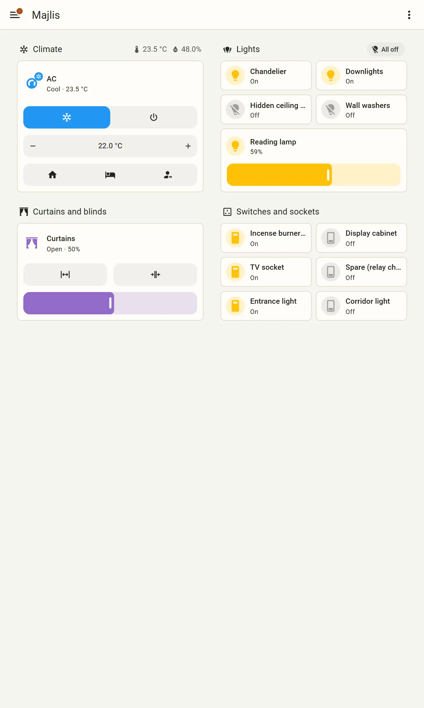
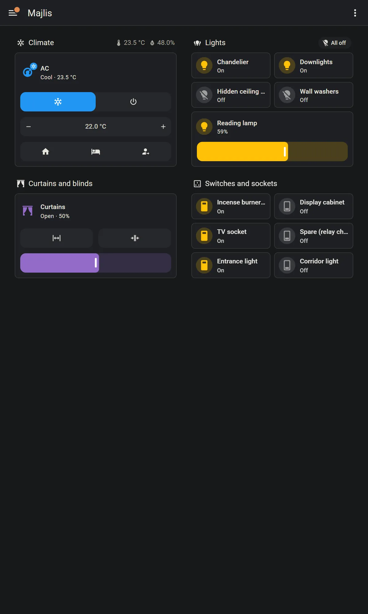
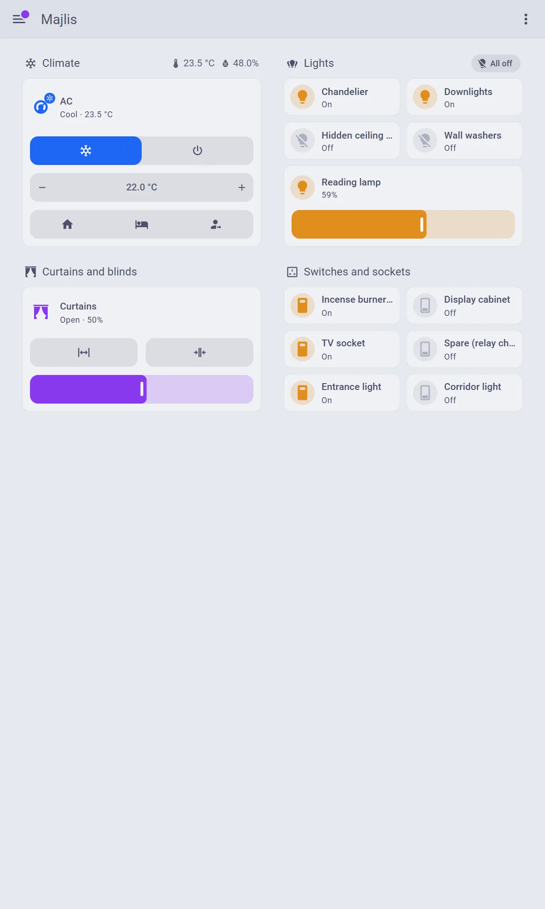
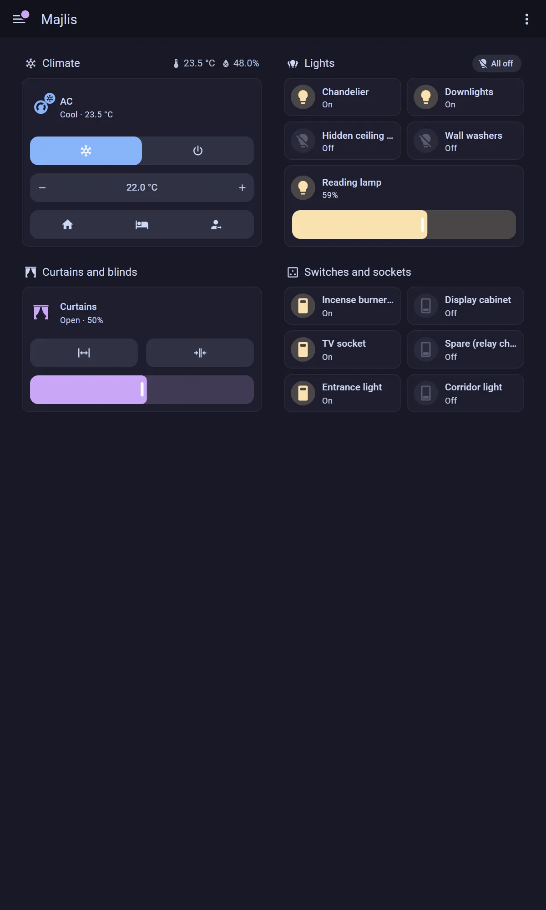
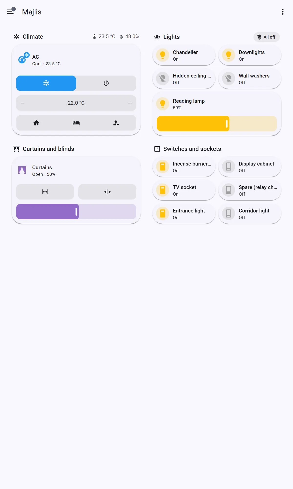
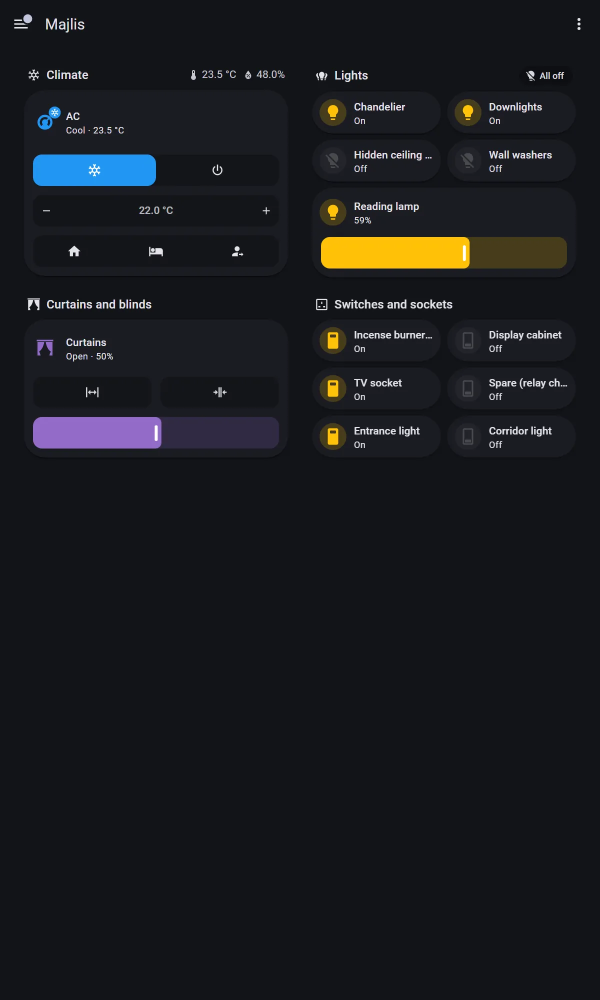
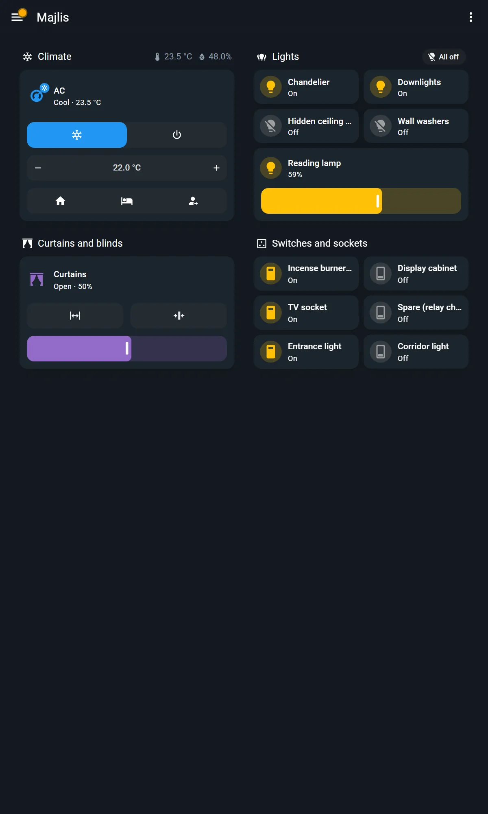
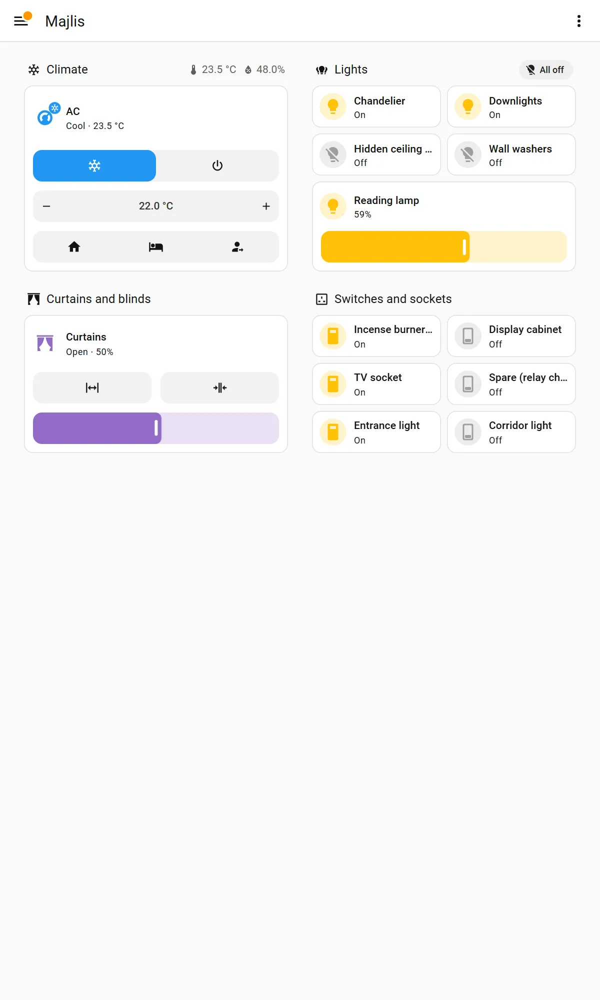
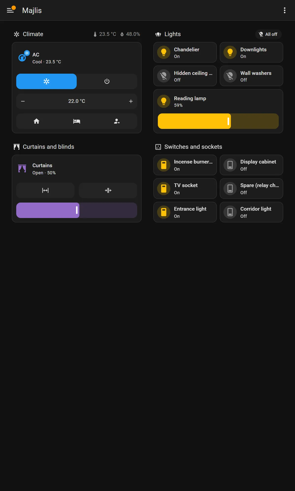

# Themes: every theme on the cloudapp.dev list, evaluated

**Source list:** <https://www.cloudapp.dev/hacs/themes>, read 2026-09-25. The
page shows 42 cards ranked by GitHub stars, each linking to its GitHub
repository. It says the collection holds 105 themes, and the other 63 are in
the data behind <https://www.cloudapp.dev/hacs>. All 105 are below, plus
Dartec's own theme and Home Assistant's default as a baseline. HACS's default
theme list has two themes that cloudapp.dev does not carry, and they were not
reviewed: `bessertristan09/graphite-nightshade-theme` and
`Matt-PMCT/Green-and-Dark-HA-Theme`.

## The answer

- **Keep the Dartec theme as the fleet default.** It passes WCAG AA in both
  modes, with text at 15.3:1 in light and 13.1:1 in dark on cards. It needs no
  card-mod, loads nothing, and has light and dark in one theme. Three small
  things need fixing (R10):
  - Its font setting uses variables that current HA no longer reads, so
    screens show Roboto. IBM Plex Sans also has no Arabic letters.
  - It does not colour the AC controls, which stay Home Assistant blue.
  - Its repository has **no licence**.
- **Offer three alternatives** where a customer wants a different look:
  **Catppuccin** (MIT), **Material You** (Apache-2.0) and **Mushroom Themes**
  (Apache-2.0). **Minimal Ninja** (Apache-2.0) also passes, but its accent is
  weak as text, and it has one maintainer and nine stars.
- **Do not install any theme that needs card-mod.** That rules out 18 of the
  105, including four of the ten most popular. See
  [maintenance.md](maintenance.md).
- **Themes matter much less than layout.** On built-in cards, the six themes
  tested on the bench produced nearly the same screen. They differ in page
  tint and accent, not in legibility or structure.

## Tested on the bench

Each theme was installed through HACS's own WebSocket commands, pinned to an
exact release, and made the system default. The screenshots show the
prototype majlis (tablet) and the bedroom panel (wall), light and dark, in
English and Arabic. They are in [screenshots/themes/](screenshots/themes/).
The themes were removed afterwards.

| Theme | Version tested | Theme entries it adds |
|---|---|---|
| Home Assistant default | 2026.9.3 | n/a |
| Dartec | v1.1.0 (`kaboomAE/dartec-theme`, added as a custom repository) | Dartec |
| Catppuccin | v2.1.3 | 7: Latte, Frappé, Macchiato, Mocha, and three "Auto Latte …" pairs that switch with light and dark |
| Material You | 5.0.15 | Material You |
| Minimal Ninja | 1.1.0 | Minimal Ninja |
| Mushroom Themes | v0.0.11 | Mushroom, Mushroom Shadow, Mushroom Square, Mushroom Square Shadow |

| | Light | Dark |
|---|---|---|
| HA default |  |  |
| Dartec |  |  |
| Catppuccin (Auto Latte Mocha) |  |  |
| Material You |  |  |
| Minimal Ninja |  |  |
| Mushroom |  |  |

The same set exists for the panel (`<theme>-panel-wall-…`) and in Arabic
(`…-ar.webp`).

### Contrast measured live

These come from the colours the browser actually resolved on the bench page
(the variables on `<home-assistant>`), each measured against the card
background:

| Theme / mode | Text | Secondary text | Accent (`primary-color`) | AC "cool" button fill | Text on page |
|---|---|---|---|---|---|
| HA default, light | 18.42 | 6.48 | 3.26 | 3.12 | 17.65 |
| HA default, dark | 13.03 | 6.13 | 5.23 | 5.45 | 14.44 |
| Dartec, light | 15.27 | 7.39 | 6.15 | 3.07 | 14.20 |
| Dartec, dark | 13.06 | 6.75 | 6.49 | 5.22 | 14.23 |
| Catppuccin, light | 7.06 | 5.53 | 4.79 | 4.34 | 6.57 |
| Catppuccin, dark | 11.34 | 9.26 | 8.07 | 7.79 | 12.14 |
| Material You, light | 15.58 | 8.50 | 5.85 | **2.83** | 14.77 |
| Material You, dark | 13.26 | 10.13 | 10.06 | 5.50 | 12.69 |
| Minimal Ninja, light | 15.52 | 4.88 | 3.11 | 3.12 | 14.32 |
| Minimal Ninja, dark | 15.52 | 5.68 | 4.99 | 4.97 | 17.51 |
| Mushroom, light | 18.42 | 6.48 | 3.26 | 3.12 | 17.65 |
| Mushroom, dark | 13.03 | 6.13 | 5.23 | 5.45 | 14.44 |

What the numbers show:

- **Text passes everywhere.** AA needs 4.5:1 for text and 3:1 for controls.
- **The AC's cool-mode button colour is the one to watch.**
  - Under Material You in light mode it falls to 2.83:1, below the 3:1 for
    controls.
  - The Dartec theme leaves it at HA's blue (3.07:1 on its cream card), so the
    most-used control in the house does not carry the brand at all.
  - Setting `state-climate-cool-color` in the Dartec theme fixes both (R10).
    It is one of the few variables HA documents as supported.
- **The accent as text.** HA's own light accent (3.26:1) and Minimal Ninja's
  (3.11:1) are fine for icons and toggles but too weak for link text.

**Arabic:** no theme changed the Arabic rendering. None of them loads a font,
so every theme falls back to the device's Arabic font, and the mirrored layout
was the same in all six. See [arabic-rtl.md](arabic-rtl.md#fonts).

## How the desk evaluation was done

- **Repository facts** come from the GitHub API on 2026-09-25: licence (SPDX),
  latest release and commit, archived flag, stars, open issues and
  `hacs.json`.
- **Maintained** is based on the last release or commit: within 12 months is
  "active", 12 to 24 months is "slowing", and over 24 months or archived is
  "unmaintained".
- **Contrast** comes from each theme's YAML, applied the way the current
  frontend applies themes:
  - A theme without a `modes: dark` block is forced to light, and its unset
    variables fall back to the light defaults.
  - The card surface is `ha-card-background`, falling back to
    `card-background-color`.
  - Translucent colours are blended over what lies beneath.
  - The table's columns are primary text / secondary text / accent
    (`primary-color`), each on the card surface.
- **WCAG AA** passes when, in every mode the theme offers:
  - text and secondary text are at least 4.5:1 on cards
  - text is at least 4.5:1 on the page
  - the accent is at least 3:1

  "Yes (dark only)" means the theme has only one mode, and it passes in that
  mode.
- **Wall-panel readability** is a judgement. A theme loses readability for:
  - secondary text under 4.5:1
  - translucent cards
  - background images
  - `backdrop-filter` blur, which is slow on cheap Android tablets
  - decorative fonts
  - reduced type sizes
- **Arabic / RTL risk** is a desk judgement:
  - **High:** the theme forces `direction`, or has many hard-coded left and
    right rules in card-mod CSS.
  - **Medium:** it names a Latin-only font, or loads web fonts.
  - **Low:** it keeps HA's default font stack, which falls back to the
    device's Arabic font.
- **Needs card-mod or custom cards** is read from `card-mod-*` keys in the
  YAML and from the README:
  - **No:** none at all.
  - **Optional (cosmetic):** only extras use it.
  - **Yes (heavy):** the look depends on it.
- **Breaks on HA updates:**
  - **High:** it depends on card-mod, which is failing on HA 2026.8 and 2026.9
    now (lovelace-card-mod issues
    [#606](https://github.com/thomasloven/lovelace-card-mod/issues/606),
    [#616](https://github.com/thomasloven/lovelace-card-mod/issues/616),
    [#617](https://github.com/thomasloven/lovelace-card-mod/issues/617)).
  - **Medium:** optional card-mod, or more than 40 overridden internal
    component variables, which revert silently when HA swaps components.
  - **Low:** neither.
- **Legacy variables.** Four older themes set their card colour only through
  `paper-card-background-color`, which HA has not read since 2025.5. On
  today's HA they compute to white cards with near-white text.

**Desk and live agree.** The desk figures for the tested themes match the live
measurements above. The one exception is HA's own light defaults: the current
frontend uses darker text (#141414 and #5e5e5e) than the older values the desk
model assumed, so the desk figures there are slightly pessimistic.

**Totals across the 105:**

- 36 have light and dark in one theme.
- 55 have no licence at all. That means all rights are reserved, so
  installing them on customer homes is copying someone's code without
  permission.
- 46 are active.
- 53 fail at least one AA check.
- 18 depend heavily on card-mod.

## Shortlist

| Rank | Theme | Why | Watch out for |
|---|---|---|---|
| 1 | **Dartec** (`kaboomAE/dartec-theme`) | Ours. AA in both modes, no dependencies, the brand palette | Add a licence, fix the font variable, colour the AC states (R10) |
| 2 | **Catppuccin** (`catppuccin/home-assistant`, MIT, v2.1.3, 2026-04-04) | AA in both modes. The accent passes even as text (4.79:1 in light). Nothing to break | The pastel look is a matter of taste. HACS installs only the mauve accent. Use the "Auto Latte …" entries so light and dark switch automatically |
| 3 | **Material You** (`Nerwyn/material-you-theme`, Apache-2.0, 5.0.15, 2026-08-23) | The most actively maintained. Targets HA 2026.6 and later. Strong contrast | Overrides about 340 internal component variables, so pin the version and check it on each HA release. The AC cool button is 2.83:1 in light. **Do not install its companion JavaScript module ("Material You Utilities")**: that is code in the homeowner's browser |
| 4 | **Mushroom Themes** (`piitaya/lovelace-mushroom-themes`, Apache-2.0, v0.0.11, 2025-09-26) | HA's own colours with softer cards. Almost nothing in it can break | The last release is a year old today, so it counts as "slowing" from tomorrow. For a theme this small that matters little |
| (5) | Minimal Ninja (`knightburton/minimal-ninja-theme`, Apache-2.0, 1.1.0, 2025-10-20) | AA text in both modes. Small, readable YAML | Green accent 3.11:1 in light. One maintainer, nine stars |

**Near misses:**

- **Graphite** (`TilmanGriesel/graphite`, MIT) passes everything except the
  light-mode accent, 2.38:1. A one-line fork would fix it.
- **Nordic** (`coltondick/nordic-theme-main`) fails the accent in one mode of
  each of its two themes.
- **Frosted Glass** (`wessamlauf/homeassistant-frosted-glass-themes`) passes AA
  but needs card-mod. It has about 140 blur rules and loads a background image
  from a CDN, which is the opposite of what cheap wall tablets need.

**Security and fleet note.** A theme is YAML that becomes CSS variables, and
it cannot run code. That is why themes are low risk, and why none of the
recommended themes needs card-mod: card-mod is JavaScript, and so is Material
You's optional module. Anything that runs code needs the owner's approval
before it goes on a customer home ([maintenance.md](maintenance.md)).

## The full table

"Tested on bench: yes" marks the six themes rendered live.

| Theme | Repository | Licence | Last release | Maintained | HA target | Light / dark | Contrast light (text / secondary / accent) | Contrast dark (same) | WCAG AA | Wall-panel readability | Arabic / RTL risk | Needs card-mod or custom cards | Breaks on HA updates | Tested on bench |
|---|---|---|---|---|---|---|---|---|---|---|---|---|---|---|
| Home Assistant default theme (baseline) | [home-assistant/default](https://github.com/home-assistant/frontend/tree/dev/src/resources/theme) | Apache-2.0 (HA frontend) | n/a | n/a | n/a | Both, one theme | 16.1 / 4.81 / 3.26 | 13.03 / 6.13 / 5.23 | Yes | Good | Low | No | Low | yes |
| Dartec (our own) | [kaboomAE/dartec-theme](https://github.com/kaboomAE/dartec-theme) | none (no LICENSE file) | v1.1.0 (2026-08-26) | active (own) | not stated | Both, one theme | 15.27 / 7.39 / 6.15 | 13.06 / 6.75 / 6.49 | Yes | Good | Low | No | Low | yes |
| Frosted Glass Theme | [wessamlauf/homeassistant-frosted-glass-themes](https://github.com/wessamlauf/homeassistant-frosted-glass-themes) | MIT | v1.3 (2025-11-24) | active | not stated | Both, one theme | 15.65 / 9.02 / 3.85 | 13.47 / 9.36 / 4.01 | Yes | Poor | Low | **Yes (heavy)** | High |  |
| iOS Themes | [basnijholt/lovelace-ios-themes](https://github.com/basnijholt/lovelace-ios-themes) | MIT | v3.0.3 (2026-05-11) | active | not stated | separate light & dark themes (14L/14D) | 7.6 / 17.71 / 1.87 | 16.58 / 11.08 / 8.06 | No: light accent 1.87 | Fair | Low | No | Low |  |
| Metrology | [Madelena/Metrology-for-Hass](https://github.com/Madelena/Metrology-for-Hass) | none | v.1.9.1 (2023-01-11) | unmaintained | not stated | Both, one theme | 18.22 / 7.07 / 4.2 | 18.58 / 10.65 / 4.13 | Yes | Fair | High | **Yes (heavy)** | High |  |
| HA LCARS | [th3jesta/ha-lcars](https://github.com/th3jesta/ha-lcars) | MIT | HA-LCARS-4.1.3 (2026-07-22) | active | hacs.json >= 2026.6 | Both, one theme | 5.5 / 5.5 / 1.3 | 5.5 / 5.5 / 1.3 | No: light accent 1.3; dark accent 1.3 | Fair | High | **Yes (heavy)** | High |  |
| Catppuccin Theme | [catppuccin/home-assistant](https://github.com/catppuccin/home-assistant) | MIT | v2.1.3 (2026-04-04) | active | not stated | Both, one theme | 7.06 / 5.53 / 4.79 | 11.34 / 9.26 / 8.07 | Yes | Good | Low | No | Low | yes |
| iOS Dark Mode Theme | [basnijholt/lovelace-ios-dark-mode-theme](https://github.com/basnijholt/lovelace-ios-dark-mode-theme) | MIT | no releases (last commit 2022-11-03) | unmaintained | not stated | dark only | n/a | 16.58 / 11.08 / 8.06 | Yes (dark only) | Fair | Low | No | Low |  |
| Material You Theme | [Nerwyn/material-you-theme](https://github.com/Nerwyn/material-you-theme) | Apache-2.0 | 5.0.15 (2026-08-23) | active | hacs.json >= 2026.6.0 | Both, one theme | 15.58 / 8.5 / 5.85 | 13.26 / 10.13 / 10.06 | Yes | Fair | Medium | No | Medium | yes |
| Graphite Theme | [TilmanGriesel/graphite](https://github.com/TilmanGriesel/graphite) | MIT | 2.7.6 (2026-06-08) | active | not stated | Both, one theme | 17.67 / 16.03 / 2.38 | 12.18 / 4.63 / 5.74 | No: light accent 2.38 | Good | Low | No | Medium |  |
| visionOS & iOS 26 Liquid Glass Theme | [Nezz/homeassistant-visionos-theme](https://github.com/Nezz/homeassistant-visionos-theme) | MIT | 3.0.7 (2026-07-25) | active | hacs.json >= 2024.5.0b0 | Both, one theme | 5.56 / 4.16 / 2.85 | 18.23 / 13.59 / 9.65 | No: light secondary 4.16; light accent 2.85 | Poor | Low | **Yes (heavy)** | High |  |
| Caule Themes Pack 1 | [ricardoquecria/caule-themes-pack-1](https://github.com/ricardoquecria/caule-themes-pack-1) | MIT | v.1.3.3 (2022-06-20) | unmaintained | not stated | separate light & dark themes (10L/30D) | 4.0 / 2.3 / 3.3 | 11.58 / 2.54 / 4.41 | No: light primary text 4.0; light secondary 2.3; light text on page 3.58; dark secondary 2.54 | Poor | Low | No | Low |  |
| Mushroom Themes | [piitaya/lovelace-mushroom-themes](https://github.com/piitaya/lovelace-mushroom-themes) | Apache-2.0 | v0.0.11 (2025-09-26) | active | hacs.json >= 2024.7.0b0 | Both, one theme | 16.1 / 4.81 / 3.26 | 13.03 / 6.13 / 5.23 | Yes | Good | Low | No | Low | yes |
| Noctis | [aFFekopp/noctis](https://github.com/aFFekopp/noctis) | none | 3.3.5 (2026-05-08) | active | not stated | dark only | n/a | 11.94 / 6.5 / 3.38 | Yes (dark only) | Fair | Medium | Optional (cosmetic) | Medium |  |
| synthwave-hass | [bbbenji/synthwave-hass](https://github.com/bbbenji/synthwave-hass) | MIT | 0.4.0 (2026-06-08) | active | not stated | dark only | n/a | 13.32 / 8.95 / 3.78 | Yes (dark only) | Good | Low | No | Low |  |
| Google Theme | [JuanMTech/google-theme](https://github.com/JuanMTech/google-theme) | none | v1.4 (2023-01-13) | unmaintained | not stated | Both, one theme | 16.1 / 6.05 / 4.51 | 14.38 / 6.61 / 7.64 | Yes | Good | Low | No | Low |  |
| Google Dark Theme | [JuanMTech/google_dark_theme](https://github.com/JuanMTech/google_dark_theme) | none | v1.13 (2023-01-12) | unmaintained | not stated | dark only | n/a | 14.38 / 6.61 / 7.64 | Yes (dark only) | Good | Low | No | Low |  |
| Slate Theme | [seangreen2/slate_theme](https://github.com/seangreen2/slate_theme) | none | no releases (last commit 2026-04-02) | active | not stated | dark only | n/a | 14.55 / 5.63 / 3.38 | Yes (dark only) | Good | Low | No | Low |  |
| Waves | [tgcowell/waves](https://github.com/tgcowell/waves) | none | v2.4.1 (2023-02-02) | unmaintained | not stated | Both, one theme | 8.1 / 3.79 / 3.75 | 8.74 / 7.5 / 3.2 | No: light secondary 3.79 | Poor | Medium | No | Low |  |
| macOS Theme | [JuanMTech/macOS-Theme](https://github.com/JuanMTech/macOS-Theme) | none | v1.4 (2023-01-13) | unmaintained | not stated | Both, one theme | 13.47 / 6.72 / 3.62 | 9.29 / 5.44 / 3.15 | Yes | Good | Low | No | Low |  |
| Cyberpunk 2077 Theme | [flejz/hass-cyberpunk-2077-theme](https://github.com/flejz/hass-cyberpunk-2077-theme) | none | 0.0.5 (2026-05-05) | active | not stated | dark only | n/a | 3.89 / 10.83 / 7.15 | No: dark primary text 3.89 | Poor | Medium | **Yes (heavy)** | High |  |
| Your Name. | [Nihvel/your_name](https://github.com/Nihvel/your_name) | none | 1.0.4 (2026-05-11) | active | not stated | dark only | n/a | 15.71 / 6.36 / 7.61 | Yes (dark only) | Poor | Medium | No | Medium |  |
| Midnight Theme | [home-assistant-community-themes/midnight](https://github.com/home-assistant-community-themes/midnight) | none | no releases (last commit 2026-06-19) | active | not stated | dark only | n/a | 9.05 / 2.89 / 2.89 | No: dark secondary 2.89; dark accent 2.89 | Poor | Low | No | Low |  |
| Google Light Theme | [JuanMTech/google_light_theme](https://github.com/JuanMTech/google_light_theme) | none | v1.13 (2023-01-12) | unmaintained | not stated | light only | 16.1 / 6.05 / 4.51 | n/a | Yes (light only) | Good | Low | No | Low |  |
| Soft Theme | [KTibow/lovelace-soft-theme](https://github.com/KTibow/lovelace-soft-theme) | MIT | no releases (last commit 2024-01-07) | unmaintained | hacs.json >= 2021.6 | Both, one theme | 14.56 / 4.4 / 3.44 | 14.96 / 5.72 / 2.57 | No: light secondary 4.4; dark accent 2.57 | Fair | Low | Optional (cosmetic) | Medium |  |
| Nordic Theme | [coltondick/nordic-theme-main](https://github.com/coltondick/nordic-theme-main) | Apache-2.0 | v2.3.9 (2026-05-04) | active | hacs.json >= 2026.4.0 | Both, one theme | 9.91 / 7.27 / 3.97 | 8.73 / 8.26 / 2.5 | No: dark accent 2.5 | Good | Low | No | Medium |  |
| iOS Theme | [JuanMTech/ios-theme](https://github.com/JuanMTech/ios-theme) | none | v.14 (2023-01-13) | unmaintained | not stated | Both, one theme | 17.01 / 3.26 / 4.02 | 15.25 / 7.69 / 4.66 | No: light secondary 3.26 | Fair | Low | No | Low |  |
| Transparent Blue | [JOHLC/transparentblue](https://github.com/JOHLC/transparentblue) | MIT | v2026.04.1 (2026-04-08) | active | not stated | dark only | n/a | 19.1 / 19.1 / 5.86 | Yes (dark only) | Poor | Low | No | Low |  |
| Amoled Theme | [home-assistant-community-themes/amoled](https://github.com/home-assistant-community-themes/amoled) | none | no releases (last commit 2022-07-12) | unmaintained | not stated | dark only | n/a | 21.0 / 6.69 / 2.32 | No: dark accent 2.32 | Good | Low | No | Low |  |
| Pip-Boy Terminal Theme | [iosue-iulianus/homeassistant-pipboy-theme](https://github.com/iosue-iulianus/homeassistant-pipboy-theme) | MIT | v1.1.0 (2026-03-20) | active | hacs.json >= 2024.5.0b0 | Both, one theme | 8.96 / 4.07 / 13.62 | 13.08 / 4.23 / 14.17 | No: light secondary 4.07; dark secondary 4.23 | Poor | Medium | **Yes (heavy)** | High |  |
| Bubble Theme 2026 | [silasmariusz/Bubble_Theme_2026](https://github.com/silasmariusz/Bubble_Theme_2026) | NOASSERTION | v0.666-hue (2026-05-01) | active | hacs.json >= 2024.2.0 | Both, one theme | 6.04 / 3.73 / 1.65 | 9.05 / 4.17 / 1.8 | No: light secondary 3.73; light accent 1.65; dark secondary 4.17; dark accent 1.8 | Poor | Medium | **Yes (heavy)** | High |  |
| Dark Teal | [aFFekopp/dark_teal](https://github.com/aFFekopp/dark_teal) | none | 1.4 (2022-03-15) | unmaintained | not stated | dark only | n/a | 9.08 / 4.95 / 3.5 | Yes (dark only) | Good | Medium | No | Low |  |
| Animated Weather Card | [wowgamr/animated-weather-card](https://github.com/wowgamr/animated-weather-card) | none | 1.3.1 (2026-08-15) | active | hacs.json >= 2026.1.1 | n/a (icons only) | 16.1 / 4.81 / 3.26 | n/a | Yes (light only) | Good | Low | No | Low |  |
| Weyland-Yutani Theme | [loryanstrant/ha-weylandyutani](https://github.com/loryanstrant/ha-weylandyutani) | MIT | v1.0.0 (2025-10-25) | active | README mentions 2024.1.0 | dark only | n/a | 13.29 / 13.45 / 13.29 | Yes (dark only) | Good | Low | **Yes (heavy)** | High |  |
| iOS Dark Mode | [JuanMTech/ios_dark_mode_theme](https://github.com/JuanMTech/ios_dark_mode_theme) | none | v1.4 (2023-01-12) | unmaintained | not stated | dark only | n/a | 15.25 / 7.69 / 4.66 | Yes (dark only) | Good | Low | No | Low |  |
| Clear Theme | [naofireblade/clear-theme](https://github.com/naofireblade/clear-theme) | MIT | v1.1 (2019-12-04) | unmaintained | hacs.json >= 0.102.0 | light only | 5.4 / 2.99 / 5.4 | n/a | No: light secondary 2.99 | Poor | Low | No | Low |  |
| Liquid Glass by Studio Prisma | [studio-prisma/homeassistant-theme-liquid-glass](https://github.com/studio-prisma/homeassistant-theme-liquid-glass) | MIT | v1.5.1 (2026-08-09) | active | hacs.json >= 2024.1.0 | separate light & dark themes (2L/5D) | 16.61 / 5.22 / 4.04 | 16.8 / 7.59 / 8.69 | Yes | Poor | Low | **Yes (heavy)** | High |  |
| Whatsapp Theme | [robinwittebol/whatsapp-theme](https://github.com/robinwittebol/whatsapp-theme) | none | 1.3.0 (2025-08-23) | slowing | not stated | Both, one theme | 12.59 / 4.14 / 3.03 | 10.53 / 4.56 / 4.72 | No: light secondary 4.14 | Fair | Low | No | Low |  |
| Dark Theme Pack for Home Assistant | [awolkers/home-assistant-themes](https://github.com/awolkers/home-assistant-themes) | MIT | v1.3.0 (2024-11-29) | slowing | not stated | dark only | n/a | 7.85 / 2.76 / 2.76 | No: dark secondary 2.76; dark accent 2.76 | Poor | Low | No | Low |  |
| Clear Theme Dark | [naofireblade/clear-theme-dark](https://github.com/naofireblade/clear-theme-dark) | MIT | v1.3 (2020-04-26) | unmaintained | hacs.json >= 0.108.9 | dark only | n/a | 6.5 / 2.37 / 6.5 | No: dark secondary 2.37 | Poor | Low | No | Low |  |
| Dracula-ish Theme for HA | [malcolmturnbull/draculaish-ha-theme](https://github.com/malcolmturnbull/draculaish-ha-theme) | MIT | V1.0.0 (2023-10-13) | unmaintained | not stated | Both, one theme | 4.12 / 4.12 / 2.11 | 11.06 / 9.59 / 4.89 | No: light primary text 4.12; light secondary 4.12; light text on page 3.83; light accent 2.11 | Poor | Low | No | Low |  |
| iOS Light Mode | [JuanMTech/ios_light_mode_theme](https://github.com/JuanMTech/ios_light_mode_theme) | none | v1.4 (2023-01-12) | unmaintained | not stated | light only | 17.01 / 3.26 / 4.02 | n/a | No: light secondary 3.26 | Fair | Low | No | Low |  |
| Nord Theme | [home-assistant-community-themes/nord](https://github.com/home-assistant-community-themes/nord) | none | no releases (last commit 2022-07-12) | unmaintained | not stated | dark only | n/a | 6.4 / 2.74 / 2.74 | No: dark secondary 2.74; dark accent 2.74 | Poor | Low | No | Low |  |
| Windows 10 themes | [mikosoft83/hass-windows10-themes](https://github.com/mikosoft83/hass-windows10-themes) | none | 3.1 (2026-06-29) | active | README mentions 2021.6 | Both, one theme | 18.93 / 5.33 / 4.05 | 18.26 / 8.81 / 4.06 | Yes | Good | Low | **Yes (heavy)** | High |  |
| Dark Orange Theme | [home-assistant-community-themes/dark-orange](https://github.com/home-assistant-community-themes/dark-orange) | none | no releases (last commit 2022-07-12) | unmaintained | not stated | dark only | n/a | 13.32 / 6.18 / 6.18 | Yes (dark only) | Good | Low | No | Low |  |
| NeuMorphix | [yakidd/NeumorphixHome](https://github.com/yakidd/NeumorphixHome) | none | 1.0.3 (2026-02-27) | active | hacs.json >= 2023.9.0 | separate light & dark themes (4L/2D) | 11.7 / 5.18 / 3.35 | 11.51 / 5.54 / 8.87 | Yes | Good | Low | **Yes (heavy)** | High |  |
| UX Goodie Theme | [fi-sch/ux_goodie_theme](https://github.com/fi-sch/ux_goodie_theme) | none | 1.9.2 (2022-03-08) | unmaintained | not stated | dark only | n/a | 19.76 / 13.2 / 4.52 | Yes (dark only) | Fair | Low | Optional (cosmetic) | Medium |  |
| Blackened Theme | [home-assistant-community-themes/blackened](https://github.com/home-assistant-community-themes/blackened) | none | no releases (last commit 2024-02-06) | unmaintained | not stated | dark only | n/a | 20.12 / 19.77 / 1.0 | No: dark accent 1.0 | Good | Low | No | Medium |  |
| Minimal Ninja | [knightburton/minimal-ninja-theme](https://github.com/knightburton/minimal-ninja-theme) | Apache-2.0 | 1.1.0 (2025-10-20) | active | not stated | Both, one theme | 15.52 / 4.88 / 3.11 | 15.52 / 5.68 / 4.99 | Yes | Fair | Low | Optional (cosmetic) | Medium | yes |
| iOS Light Mode Theme | [basnijholt/lovelace-ios-light-mode-theme](https://github.com/basnijholt/lovelace-ios-light-mode-theme) | MIT | no releases (last commit 2020-01-20) | unmaintained | not stated | light only | 7.6 / 17.71 / 1.85 | n/a | No: light accent 1.85 | Fair | Low | No | Low |  |
| 3Ative Blue Theme | [3ative/3ative-blue-theme](https://github.com/3ative/3ative-blue-theme) | MIT | 19.1 (2026-05-14) | active | not stated | dark only | n/a | 15.31 / 8.34 / 8.03 | Yes (dark only) | Fair | Low | No | Low |  |
| Blue Night Theme | [home-assistant-community-themes/blue-night](https://github.com/home-assistant-community-themes/blue-night) | none | no releases (last commit 2023-09-23) | unmaintained | not stated | dark only | n/a | 13.24 / 10.27 / 3.82 | Yes (dark only) | Good | Low | No | Low |  |
| GitHub Dark Theme | [einschmidt/github_dark_theme](https://github.com/einschmidt/github_dark_theme) | none | v2.3 (2023-08-23) | unmaintained | not stated | dark only | n/a | 9.29 / 5.54 / 3.28 | Yes (dark only) | Good | Low | No | Low |  |
| Vintage Theme | [Banditen01/vintage_theme](https://github.com/Banditen01/vintage_theme) | none | v2.1.0 (2026-09-05) | active | not stated | light only | 4.4 / 4.4 / 4.4 | n/a | No: light primary text 4.4; light secondary 4.4 | Poor | Low | No | Low |  |
| sweet pink | [estiens/sweet_pink_hass_theme](https://github.com/estiens/sweet_pink_hass_theme) | GPL-3.0 | 1.1.2 (2025-04-08) | active | not stated | dark only | n/a | 17.5 / 6.15 / 4.9 | Yes (dark only) | Good | Medium | No | Low |  |
| Noctis-Solarized | [williamahartman/noctis-solarized](https://github.com/williamahartman/noctis-solarized) | none | no releases (last commit 2022-03-06) | unmaintained | not stated | dark only | n/a | 4.86 / 4.11 / 3.53 | No: dark secondary 4.11 | Fair | Medium | Optional (cosmetic) | Medium |  |
| Google Dark Theme | [pacjo/google_dark_animated](https://github.com/pacjo/google_dark_animated) | none | v1.9 (2021-09-17) | unmaintained | not stated | dark only | n/a | 14.38 / 6.61 / 7.64 | Yes (dark only) | Good | Low | No | Low |  |
| Darkish Theme | [78wesley/Home-Assistant-Darkish-Theme](https://github.com/78wesley/Home-Assistant-Darkish-Theme) | none | v1.0.4 (2025-12-23) | active | not stated | dark only | n/a | 12.89 / 6.07 / 6.41 | Yes (dark only) | Good | Low | No | Low |  |
| Dark Pastel | [chaptergy/homeassistant-theme-dark-pastel](https://github.com/chaptergy/homeassistant-theme-dark-pastel) | none | 1.1.1 (2025-09-05) | slowing | not stated | dark only | n/a | 16.48 / 8.98 / 9.6 | Yes (dark only) | Good | Medium | No | Medium |  |
| Amoled Dark Theme | [Xitee1/ha-amoled-theme](https://github.com/Xitee1/ha-amoled-theme) | none | v0.0.1 (2025-08-10) | slowing | not stated | dark only | n/a | 14.09 / 6.63 / 5.66 | Yes (dark only) | Good | Low | No | Low |  |
| Midnight Blue Theme | [home-assistant-community-themes/midnight-blue](https://github.com/home-assistant-community-themes/midnight-blue) | none | no releases (last commit 2022-07-12) | unmaintained | not stated | dark only | n/a | 9.05 / 3.44 / 3.44 | No: dark secondary 3.44 | Fair | Low | No | Low |  |
| Oxford Blue | [arsaboo/oxford_blue_theme](https://github.com/arsaboo/oxford_blue_theme) | GPL-3.0 | no releases (last commit 2020-02-27) | unmaintained | not stated | light only | 14.67 / 2.92 / 8.78 | n/a | No: light secondary 2.92 | Poor | Low | No | Low |  |
| Glass Dynamic Dashboard | [jbsky/ha-glass-dashboard](https://github.com/jbsky/ha-glass-dashboard) | MIT | v2.1.0 (2026-08-08) | active | README mentions 2026.8 | light only | 4.18 / 2.92 / 1.89 | n/a | No: light primary text 4.18; light secondary 2.92; light text on page 1.04; light accent 1.89 | Poor | Low | No | Low |  |
| Blocky | [PixNyb/hass-theme-blocky](https://github.com/PixNyb/hass-theme-blocky) | none | v1.0.4 (2026-08-09) | active | not stated | Both, one theme | 19.77 / 5.7 / 3.05 | 9.69 / 4.86 / 4.62 | Yes | Fair | Low | No | Low |  |
| GitHub Light Theme | [einschmidt/github_light_theme](https://github.com/einschmidt/github_light_theme) | none | v1.3 (2020-12-16) | unmaintained | not stated | light only | 12.24 / 2.75 / 5.42 | n/a | No: light secondary 2.75 | Poor | Low | No | Low |  |
| Vaporwave Pink Theme | [home-assistant-community-themes/vaporwave-pink](https://github.com/home-assistant-community-themes/vaporwave-pink) | MIT | v1.1 (2020-01-16) | unmaintained | not stated | light only | 12.29 / 3.26 / 2.47 | n/a | No: light secondary 3.26; light accent 2.47 | Fair | Low | No | Low |  |
| Swart Ninja Dark Theme | [DickSwart/swart_ninja_dark_theme](https://github.com/DickSwart/swart_ninja_dark_theme) | MIT | v1.0.2 (2020-10-15) | unmaintained | not stated | dark only | n/a | 8.93 / 4.89 / 3.63 | Yes (dark only) | Good | Low | No | Low |  |
| Sundown Theme | [am80l/sundown](https://github.com/am80l/sundown) | none | 1.0.6 (2020-07-29) | unmaintained | not stated | dark only | n/a | 11.14 / 3.55 / 2.82 | No: dark secondary 3.55; dark accent 2.82 | Fair | Low | No | Low |  |
| Grey Night Theme | [home-assistant-community-themes/grey-night](https://github.com/home-assistant-community-themes/grey-night) | none | no releases (last commit 2024-02-06) | unmaintained | not stated | dark only | n/a | 13.24 / 10.27 / 2.41 | No: dark accent 2.41 | Good | Low | No | Low |  |
| Aqua Fiesta Theme | [home-assistant-community-themes/aqua-fiesta](https://github.com/home-assistant-community-themes/aqua-fiesta) | none | v1.0 (2019-12-05) | unmaintained | not stated | dark only | n/a | 6.74 / 3.29 / 3.29 | No: dark secondary 3.29 | Fair | Low | No | Low |  |
| Dark Mint Theme | [home-assistant-community-themes/dark-mint](https://github.com/home-assistant-community-themes/dark-mint) | none | no releases (last commit 2022-07-12) | unmaintained | not stated | dark only | n/a | 12.63 / 5.24 / 5.24 | Yes (dark only) | Good | Low | No | Low |  |
| Material Dark Pink Theme | [home-assistant-community-themes/material-dark-pink](https://github.com/home-assistant-community-themes/material-dark-pink) | none | no releases (last commit 2022-07-12) | unmaintained | not stated | dark only | n/a | 12.98 / 6.81 / 1.0 | No: dark accent 1.0 | Good | Low | No | Low |  |
| Solarized Light Theme | [home-assistant-community-themes/solarized-light](https://github.com/home-assistant-community-themes/solarized-light) | none | no releases (last commit 2022-07-12) | unmaintained | not stated | light only | 4.45 / 2.67 / 5.38 | n/a | No: light primary text 4.45; light secondary 2.67; light text on page 4.13 | Poor | Low | No | Low |  |
| Material Dark Red Theme | [home-assistant-community-themes/material-dark-red](https://github.com/home-assistant-community-themes/material-dark-red) | none | no releases (last commit 2022-07-12) | unmaintained | not stated | dark only | n/a | 8.11 / 2.54 / 2.54 | No: dark secondary 2.54; dark accent 2.54 | Poor | Low | No | Low |  |
| MorphHomeX | [robex2005/MorphHomeX](https://github.com/robex2005/MorphHomeX) | MIT | v1.2.1 (2026-07-31) | active | hacs.json >= 2023.9.0 | separate light & dark themes (2L/10D) | 11.7 / 5.18 / 3.35 | 11.51 / 5.54 / 8.87 | Yes | Good | Low | **Yes (heavy)** | High |  |
| Skynet Dark Theme | [skynet01/homeassistant-skynet-theme](https://github.com/skynet01/homeassistant-skynet-theme) | GPL-3.0 | v1.0.9 (2026-07-07) | active | not stated | dark only | n/a | 5.6 / 1.92 / 8.99 | No: dark secondary 1.92 | Poor | Medium | **Yes (heavy)** | High |  |
| Bootstrap 5 | [Eonasdan/home-assistant-bootstrap-5-theme](https://github.com/Eonasdan/home-assistant-bootstrap-5-theme) | MIT | v1.0.0 (2024-03-05) | unmaintained | not stated | Both, one theme | 15.43 / 6.78 / 4.5 | 11.85 / 7.29 / 3.43 | Yes | Good | Low | No | Low |  |
| Halloween Theme | [home-assistant-community-themes/halloween](https://github.com/home-assistant-community-themes/halloween) | none | no releases (last commit 2022-07-12) | unmaintained | not stated | dark only | n/a | 3.84 / 3.84 / 3.84 | No: dark primary text 3.84; dark secondary 3.84; dark text on page 3.69 | Poor | Low | No | Low |  |
| Vastayan Bond | [SnakeFist007/ha_vastayan_bond](https://github.com/SnakeFist007/ha_vastayan_bond) | none | v1.3 (2022-01-17) | unmaintained | not stated | Both, one theme | 19.83 / 5.85 / 3.49 | 20.75 / 4.7 / 3.26 | Yes | Fair | Medium | No | Low |  |
| Midnight Teal | [Neekster/MidnightTeal](https://github.com/Neekster/MidnightTeal) | none | v2.1 (2022-03-11) | unmaintained | not stated | Both, one theme | 2.46 / 2.05 / 2.27 | 11.56 / 7.51 / 4.22 | No: light primary text 2.46; light secondary 2.05; light text on page 2.06; light accent 2.27 | Poor | Low | No | Low |  |
| Very Dark Black HA Theme | [PlayFaster/very-dark-black-ha-theme](https://github.com/PlayFaster/very-dark-black-ha-theme) | MIT | v1.4.1 (2026-08-02) | active | hacs.json >= 2022.11.0 | Both, one theme | 16.06 / 8.83 / 6.72 | 16.06 / 8.83 / 6.72 | Yes | Good | Low | **Yes (heavy)** | High |  |
| Gruvbox Theme | [kizza/homeassistant-gruvbox-theme](https://github.com/kizza/homeassistant-gruvbox-theme) | MIT | 1.0.2 (2026-09-04) | active | not stated | Both, one theme | 6.74 / 3.1 / 3.37 | 8.79 / 4.75 / 2.74 | No: light secondary 3.1; dark accent 2.74 | Fair | Low | No | Low |  |
| ArcticForest Dark | [mjs271/arcticForest-dark_HA](https://github.com/mjs271/arcticForest-dark_HA) | NOASSERTION | v0.1.5 (2026-05-30) | active | not stated | dark only | n/a | 6.68 / 4.8 / 3.35 | Yes (dark only) | Good | Low | No | Medium |  |
| Blackout Theme | [loryanstrant/blackout](https://github.com/loryanstrant/blackout) | MIT | v1.0.0 (2025-06-28) | active | not stated | dark only | n/a | 21.0 / 14.03 / 6.45 | Yes (dark only) | Good | Low | No | Low |  |
| BrezNET iOS | [brezlord/BrezNET-iOS](https://github.com/brezlord/BrezNET-iOS) | MIT | v2.0.0 (2025-10-17) | active | not stated | Both, one theme | 8.18 / 4.31 / 3.36 | 13.55 / 7.69 / 4.97 | No: light secondary 4.31 | Fair | Low | Optional (cosmetic) | Medium |  |
| IDX | [veniplex/hass-idx-theme](https://github.com/veniplex/hass-idx-theme) | none | 1.1.1 (2024-10-10) | slowing | hacs.json >= 2024.7.1 | Both, one theme | 10.07 / 5.12 / 4.1 | 15.31 / 6.98 / 6.84 | Yes | Good | Low | No | Low |  |
| MilCom Army | [Djelle/milcomarmy](https://github.com/Djelle/milcomarmy) | Unlicense | v2.0 (2024-06-20) | slowing | not stated | separate light & dark themes (3L/1D) | 16.1 / 4.81 / 3.26 | 1.27 / 1.0 / 1.35 | No: dark primary text 1.27; dark secondary 1.0; dark accent 1.35 | Poor | Low | No | Low |  |
| Stell Blue with Colors Theme | [home-assistant-community-themes/stell-blue-with-colors](https://github.com/home-assistant-community-themes/stell-blue-with-colors) | none | no releases (last commit 2023-12-08) | unmaintained | not stated | dark only | n/a | 5.65 / 1.94 / 1.8 | No: dark secondary 1.94; dark accent 1.8 | Poor | Low | No | Low |  |
| Material Dark Green Theme | [home-assistant-community-themes/material-dark-green](https://github.com/home-assistant-community-themes/material-dark-green) | none | no releases (last commit 2022-07-12) | unmaintained | not stated | dark only | n/a | 1.07 / 1.07 / 2.94 | No: dark primary text 1.07; dark secondary 1.07; dark accent 2.94 | Poor | Low | No | Low |  |
| Material 3 Dark & Light Theme 07: DarkOliveGreen | [AmoebeLabs/HA-Theme_M3-07-DarkOliveGreen](https://github.com/AmoebeLabs/HA-Theme_M3-07-DarkOliveGreen) | MIT | v1.1.2 (2022-02-22) | unmaintained | not stated | Both, one theme | 16.69 / 6.3 / 6.27 | 9.1 / 9.1 / 9.08 | Yes | Good | Low | No | Low |  |
| Yeelight Themes | [Yeelight/ha_yeelight_themes](https://github.com/Yeelight/ha_yeelight_themes) | MIT | v1.0.2 (2026-06-21) | active | hacs.json >= 2024.1.0 | Both, one theme | 14.98 / 5.02 / 1.72 | 14.97 / 7.76 / 10.69 | No: light accent 1.72 | Good | Low | No | Medium |  |
| Everyday | [f17mkx/everyday-themes](https://github.com/f17mkx/everyday-themes) | MIT | v1.0.1 (2026-05-13) | active | hacs.json >= 2024.6.0 | Both, one theme | 18.4 / 7.1 / 16.89 | 15.54 / 8.14 / 2.04 | No: dark accent 2.04 | Poor | Medium | **Yes (heavy)** | High |  |
| Red slate theme | [Poeschl/slate_red](https://github.com/Poeschl/slate_red) | Apache-2.0 | 1.7.0 (2026-04-20) | active | not stated | dark only | n/a | 12.43 / 12.43 / 2.92 | No: dark accent 2.92 | Good | Low | No | Low |  |
| Blue Theme by taikun114 | [taikun114/Blue-Theme-by-taikun114](https://github.com/taikun114/Blue-Theme-by-taikun114) | none | v1.0.6 (2026-04-05) | active | not stated | Both, one theme | 19.93 / 4.08 / 2.87 | 10.77 / 6.19 / 3.4 | No: light secondary 4.08; light accent 2.87 | Fair | Medium | No | Low |  |
| Ugly Christmas Theme | [houtknots/UglyChristmas-Theme](https://github.com/houtknots/UglyChristmas-Theme) | none | v2026.2.1 (2026-02-26) | active | not stated | Both, one theme | 6.4 / 5.1 / 2.49 | 8.8 / 7.02 / 3.43 | No: light accent 2.49 | Good | Low | No | Low |  |
| Star Wars inspired Dark-mode theme | [Stormrage-DJ/ha_theme_star_wars_dark](https://github.com/Stormrage-DJ/ha_theme_star_wars_dark) | none | v1.0 (2025-08-22) | slowing | not stated | dark only | n/a | 14.5 / 6.85 / 6.85 | Yes (dark only) | Fair | Medium | **Yes (heavy)** | High |  |
| Teal Theme | [home-assistant-community-themes/teal](https://github.com/home-assistant-community-themes/teal) | none | no releases (last commit 2022-07-12) | unmaintained | not stated | dark only | n/a | 1.0 / 1.0 / 1.57 | No: dark primary text 1.0; dark secondary 1.0; dark accent 1.57 | Poor | Low | No | Low |  |
| Christmas Theme | [home-assistant-community-themes/christmas](https://github.com/home-assistant-community-themes/christmas) | none | no releases (last commit 2022-07-12) | unmaintained | not stated | dark only | n/a | 1.0 / 21.0 / 6.71 | No: dark primary text 1.0 | Poor | Low | No | Low |  |
| Material 3 Dark & Light Theme 04: Magenta | [AmoebeLabs/HA-Theme_M3-04-Magenta](https://github.com/AmoebeLabs/HA-Theme_M3-04-Magenta) | MIT | v1.1.2 (2022-02-22) | unmaintained | not stated | Both, one theme | 16.71 / 6.31 / 6.26 | 9.08 / 9.09 / 9.06 | Yes | Good | Low | No | Low |  |
| Material 3 Dark & Light Theme C11: Purple | [AmoebeLabs/HA-Theme_M3-C11-Purple](https://github.com/AmoebeLabs/HA-Theme_M3-C11-Purple) | MIT | v1.1.2 (2022-06-01) | unmaintained | not stated | Both, one theme | 16.66 / 6.29 / 6.32 | 9.07 / 9.01 / 9.09 | Yes | Good | Low | No | Low |  |
| Vibrant (Dark) Clear Theme | [myleskeeffe/clear-theme-dark-vibrant](https://github.com/myleskeeffe/clear-theme-dark-vibrant) | MIT | v2.0.7 (2021-02-10) | unmaintained | hacs.json >= 0.109.0 | dark only | n/a | 6.5 / 2.37 / 6.5 | No: dark secondary 2.37 | Poor | Low | No | Low |  |
| Green Slate Theme | [pbeckcom/green_slate_theme](https://github.com/pbeckcom/green_slate_theme) | none | no releases (last commit 2019-11-20) | unmaintained | not stated | dark only | n/a | 14.55 / 5.39 / 5.39 | Yes (dark only) | Good | Low | No | Low |  |
| Nuit Mediterraneenne | [florent6901/home-assistant-nuit_mediterraneenne](https://github.com/florent6901/home-assistant-nuit_mediterraneenne) | MIT | V1.0.2 (2026-06-18) | active | not stated | separate light & dark themes (1L/3D) | 13.64 / 8.53 / 11.47 | 13.92 / 5.72 / 3.83 | Yes | Fair | Low | No | Low |  |
| TET-49 | [mattschwarz/tet-49-theme](https://github.com/mattschwarz/tet-49-theme) | MIT | v1.0.1 (2026-08-25) | active | hacs.json >= 2026.5.0 | dark only | n/a | 15.99 / 5.74 / 12.63 | Yes (dark only) | Fair | High | **Yes (heavy)** | High |  |
| Gradient Themes | [mycrouch/gradient-themes](https://github.com/mycrouch/gradient-themes) | MIT | v1.2.1 (2026-07-06) | active | not stated | light only | 16.1 / 5.74 / 7.28 | n/a | Yes (light only) | Fair | Low | No | Low |  |
| Raznor Obsidian | [Raznor09/raznor-obsidian](https://github.com/Raznor09/raznor-obsidian) | MIT | v1.1.3 (2026-07-03) | active | not stated | Both, one theme | 19.8 / 8.06 / 2.27 | 15.55 / 7.15 / 7.67 | No: light accent 2.27 | Good | Low | No | Low |  |
| Star Wars inspired Light-mode theme | [Stormrage-DJ/ha_theme_star_wars_light](https://github.com/Stormrage-DJ/ha_theme_star_wars_light) | none | v1.0 (2025-08-22) | slowing | not stated | light only | 11.03 / 6.49 / 6.49 | n/a | Yes (light only) | Fair | Medium | **Yes (heavy)** | High |  |
