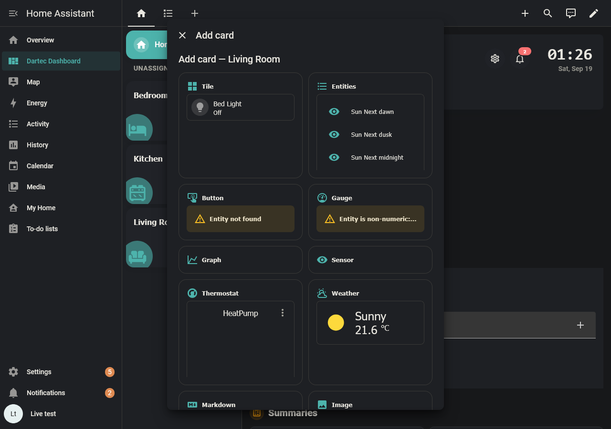
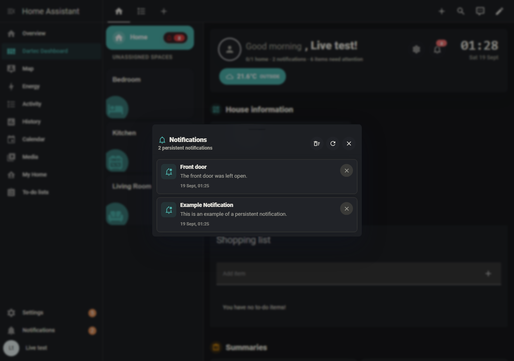
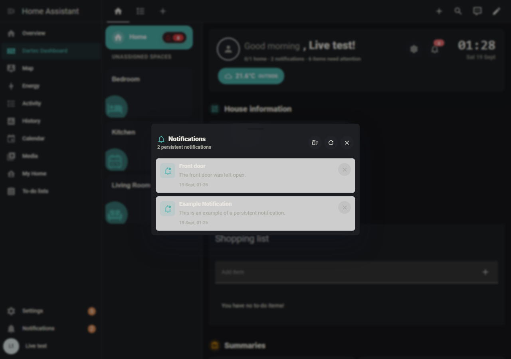
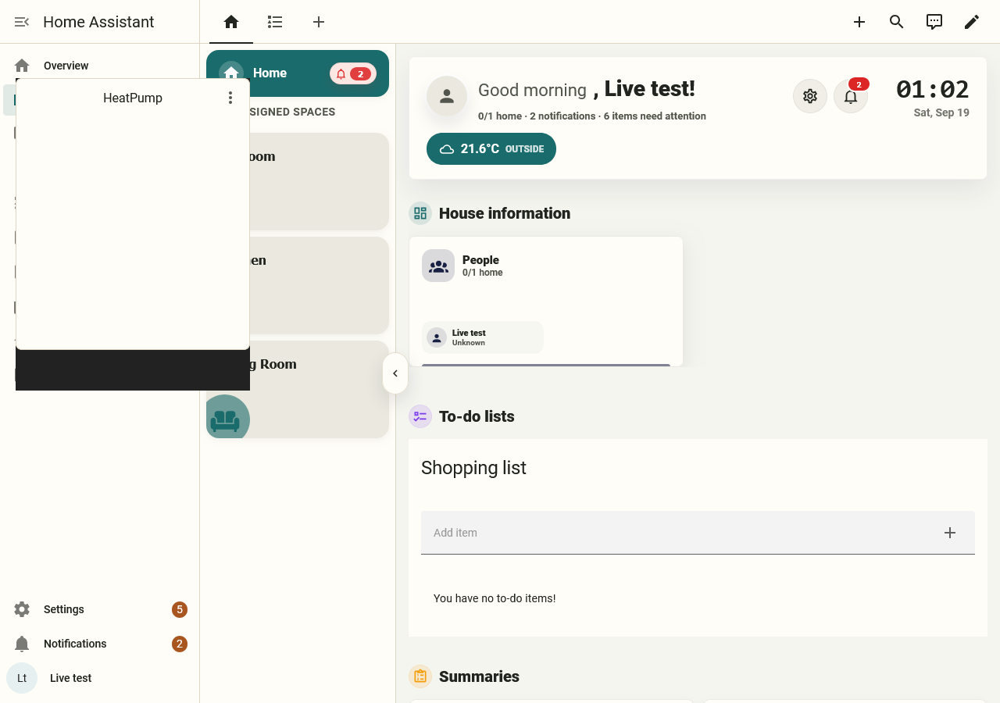
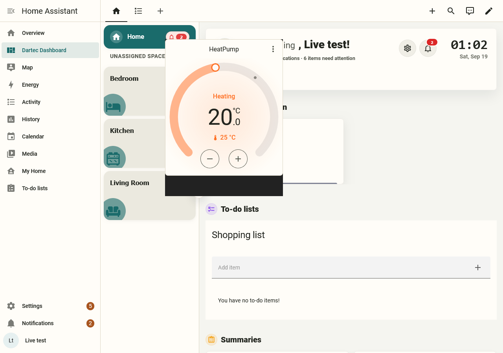

# Dwains' Add card pop-up and the dashboard fix (dartec-ha-manager#25)

Evidence from `tests/live/run_live_dwains.py` on Home Assistant 2026.9.3 with
Dwains Dashboard Next v1.8.0, card-mod v4.2.1 and dartec-theme v1.1.0.
Demo data only. The full table for all 32 combinations is in
`results-2026.9.3.md`.

| | Dashboard fix loaded | Dashboard fix blocked |
|---|---|---|
| Add card pop-up, Firefox, dark mode, Dartec theme, card-mod on. The thermostat preview is blank in both. |  |  |
| Dwains' notification panel, dark mode, Dartec theme. This is what the fix is for: 12.59:1 with it, 1.25:1 without it. |  |  |

The cause, with the fix blocked: the same Dwains card host, with the same `hass`:

| Mounted under `document.body` (where Dwains puts its pop-ups) | Mounted inside `<home-assistant>` |
|---|---|
|  `this._formatters is undefined` |  no error |

Reported upstream as dwainscheeren/dwains-dashboard-next#18.
