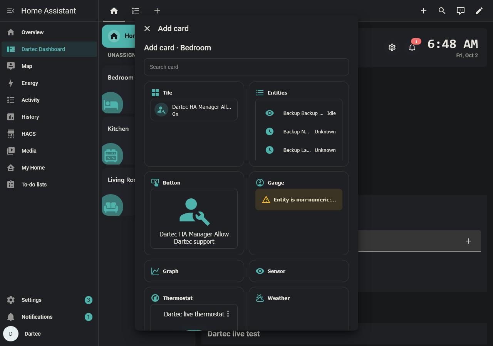
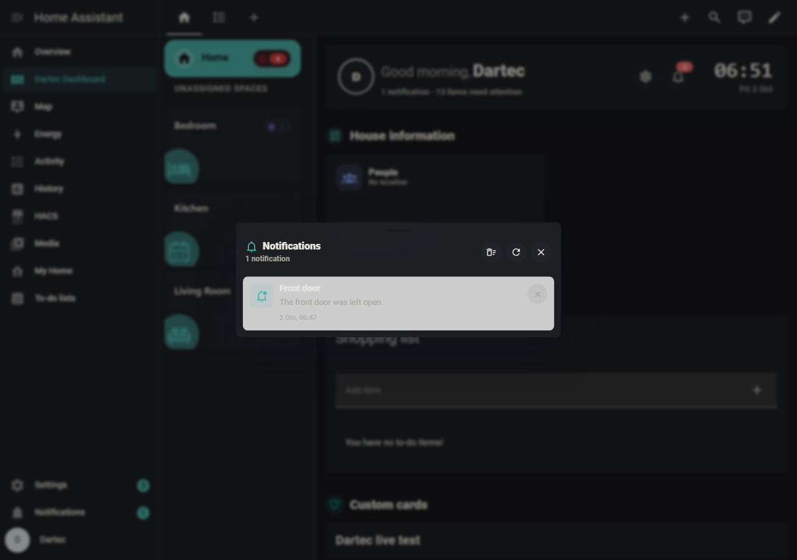
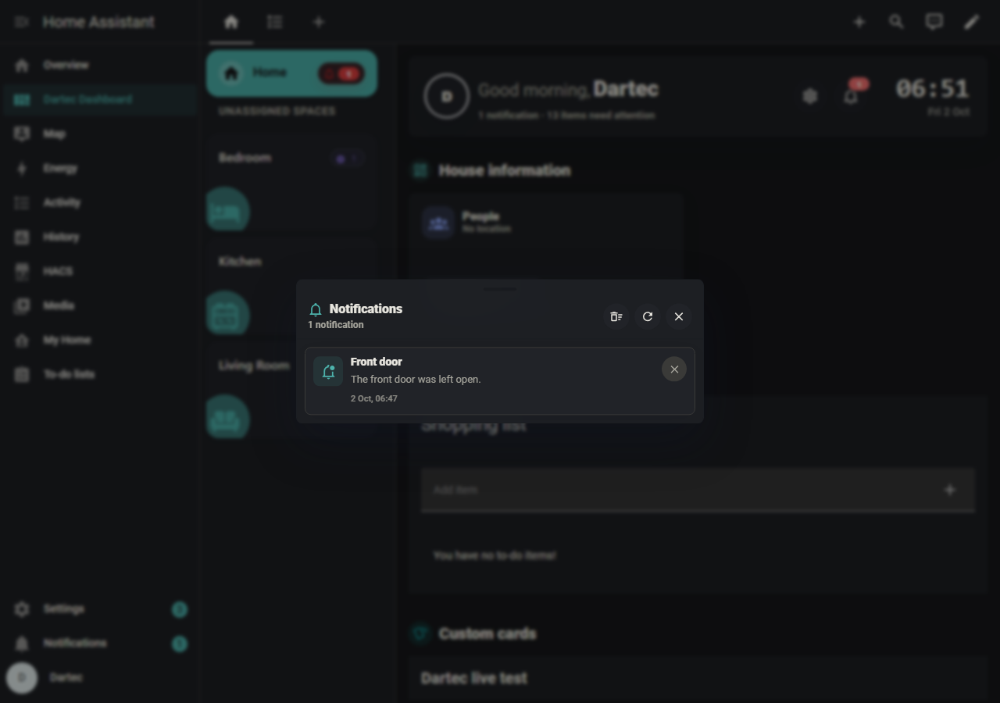
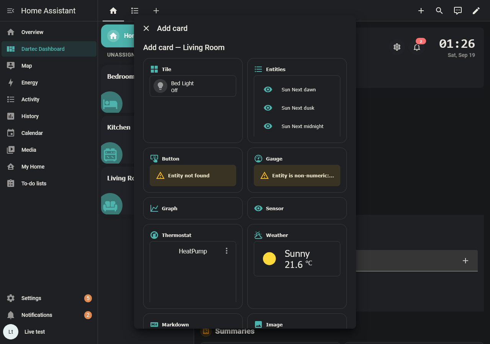
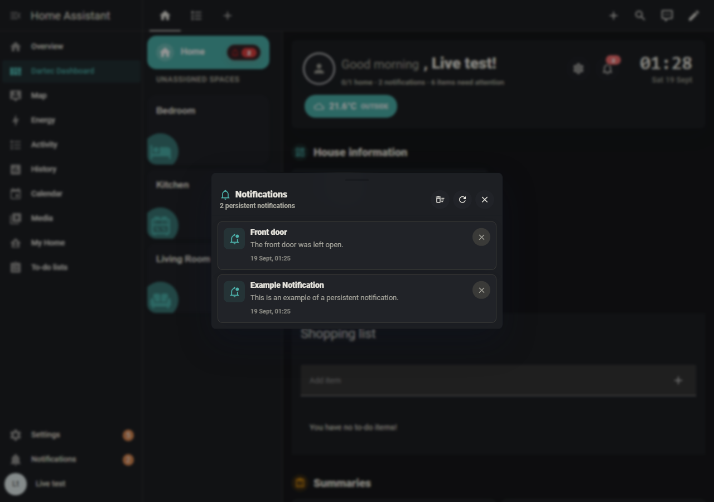
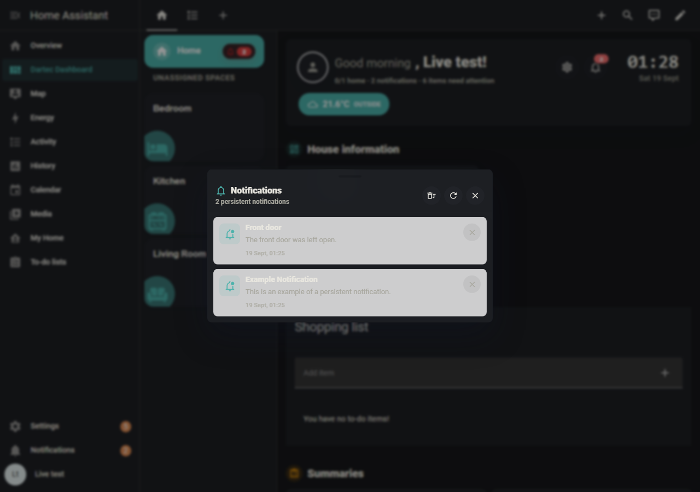
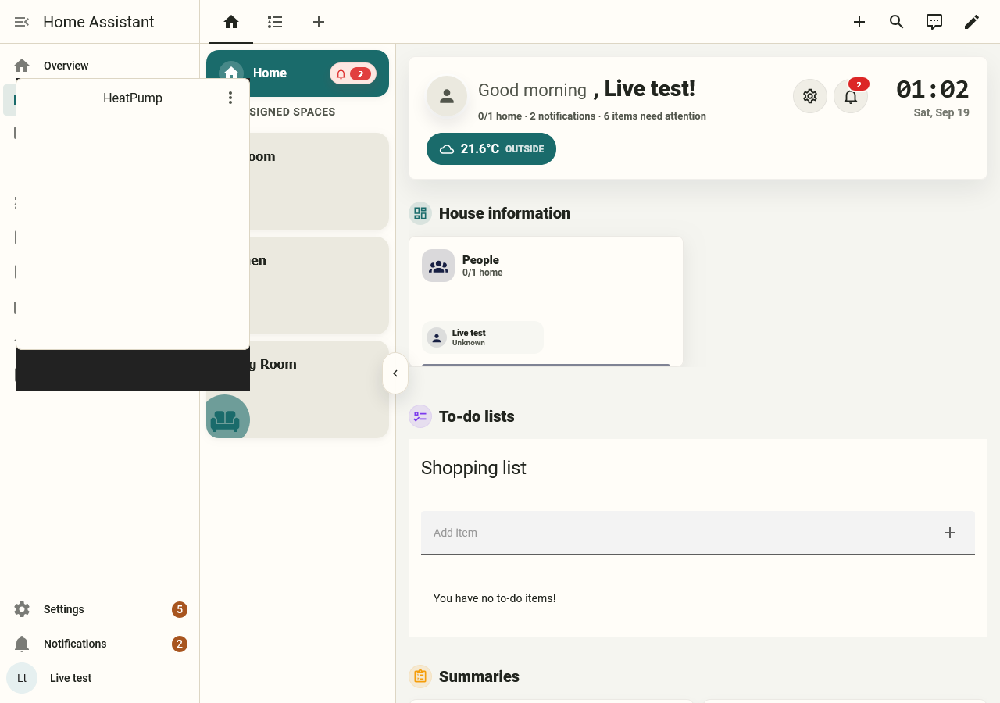
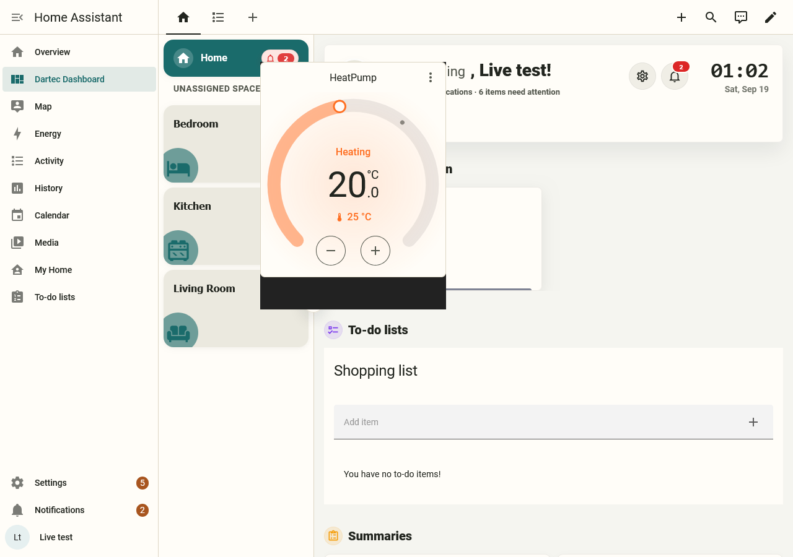

# Dwains' Add card pop-up and the dashboard fix (dartec-ha-manager#25)

## Since 2026-10-02: fixed upstream, workarounds gated

Dwains Dashboard Next fixed all three bugs Dartec reported in **v1.8.1**
(2026-09-30):

- **#18:** the Add card previews broke on HA 2026.7+. Dialogs are now mounted
  inside `<home-assistant>`.
- **#19:** the card editor forgot its choices. Dwains now hands the editor its
  config back.
- **#20:** Home custom cards vanished on reload.

All three stay fixed in v1.10.0. That was measured on the bench (Pi 5,
location TEST, HA 2026.9.3, v1.10.0 installed through HACS at that exact
version), and in containers for 1.8.0, 1.8.1 and 1.10.0. Full tables:
[results-2026-10-02.md](results-2026-10-02.md).

`www/dashboard-fix.js` keeps the workarounds for homes still on 1.8.0, but
they now act only where Dwains did not fix the bug. Dwains exposes no version
to the page, so each one is gated by what Dwains does:

| Workaround | Acts only when | On 1.8.1 and later |
|---|---|---|
| Move the picker inside `<home-assistant>` (#18) | Dwains put the picker on `document.body` | never; Dwains mounts it inside |
| Hand the editor its config back (#19) | the editor is in a picker Dwains put on `document.body` (new) | never; agent 0.24.0 did it on every release, a second `setConfig` per change |
| Carry `home_custom_cards` to the views (#20) | Dwains built a view without the key | never; Dwains always passes it |
| Notification row readable in dark mode | always | still needed: 1.25:1 without, 12.59:1 with |

**Cards are not brought back by the update.** Dwains 1.8.0's settings editor
also emptied `home_custom_cards` on every save, which no workaround could
undo. Any Home custom card lost that way has to be added again once, after
updating.

| Bench, Dwains 1.10.0, fix blocked: the thermostat preview is clean | Notification row, dark mode, fix blocked (1.25:1) | The same with this tree's fix (12.59:1) |
|---|---|---|
|  |  |  |

## 2026-09-19: the original diagnosis

Evidence from `tests/live/run_live_dwains.py` on Home Assistant 2026.9.3 with
Dwains Dashboard Next v1.8.0, card-mod v4.2.1 and dartec-theme v1.1.0. Demo
data only. The full table for all 32 combinations is in
`results-2026.9.3.md`.

| | Dashboard fix loaded | Dashboard fix blocked |
|---|---|---|
| Add card pop-up, Firefox, dark mode, Dartec theme, card-mod on. The thermostat preview is blank in both. |  |  |
| Dwains' notification panel, dark mode, Dartec theme. This is what the fix is for: 12.59:1 with it, 1.25:1 without it. |  |  |

The cause, with the fix blocked: the same Dwains card host, with the same `hass`:

| Mounted under `document.body` (where Dwains puts its pop-ups) | Mounted inside `<home-assistant>` |
|---|---|
|  `this._formatters is undefined` |  no error |

Reported upstream as dwainscheeren/dwains-dashboard-next#18.
