# My Home — the people in your home

**[العربية](#بيتي--أفراد-منزلك)** · English

"My Home" is in the sidebar of your Home Assistant, on your computer and in the
Home Assistant app on your phone. Use it to add your family and guests, set a
new password when someone forgets theirs, and pause or remove someone's access.

Only people who can manage the home see it: the owner, and anyone you add as
**Family (can manage the home)**.

| Phone | Computer |
|---|---|
| 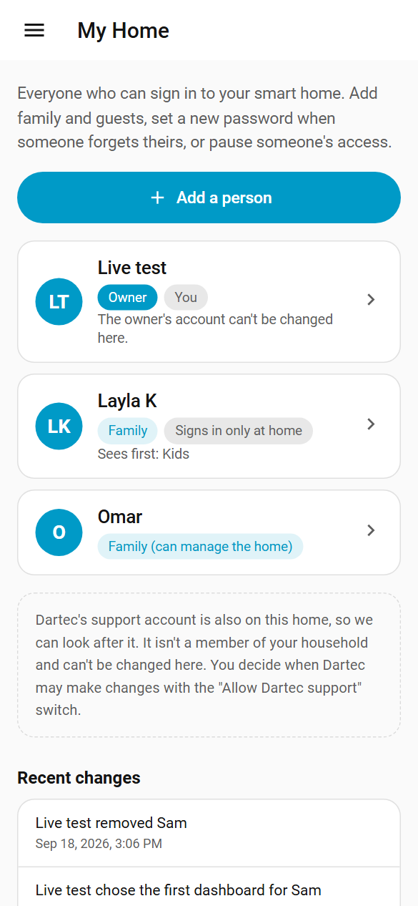 | 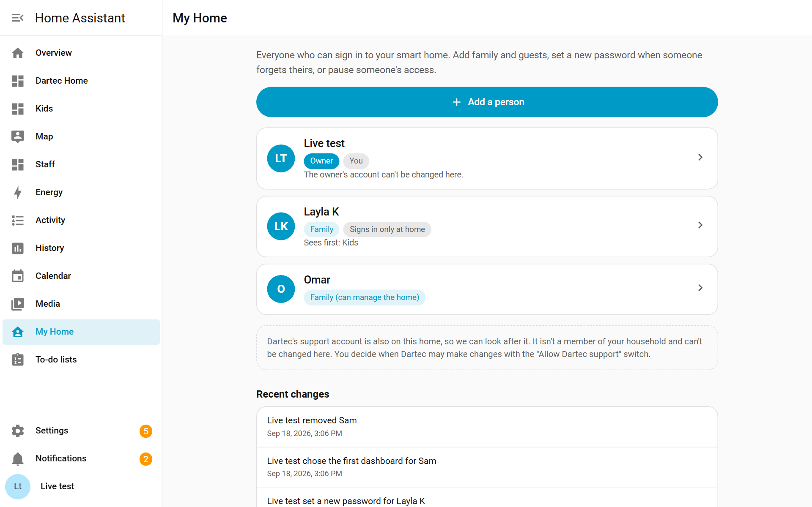 |

## Add a person

1. Tap **Add a person**.
2. Type their **name** and a **username** (what they type to sign in).
3. Type a password, or tap **Make one for me**. The bar shows how strong it is.
4. Choose **what they can do** (see below).
5. Optionally, choose the **first dashboard they see**.
6. Tap **Add person**. The next screen shows their username and password once:
   give them to the person, or tap **Copy**.

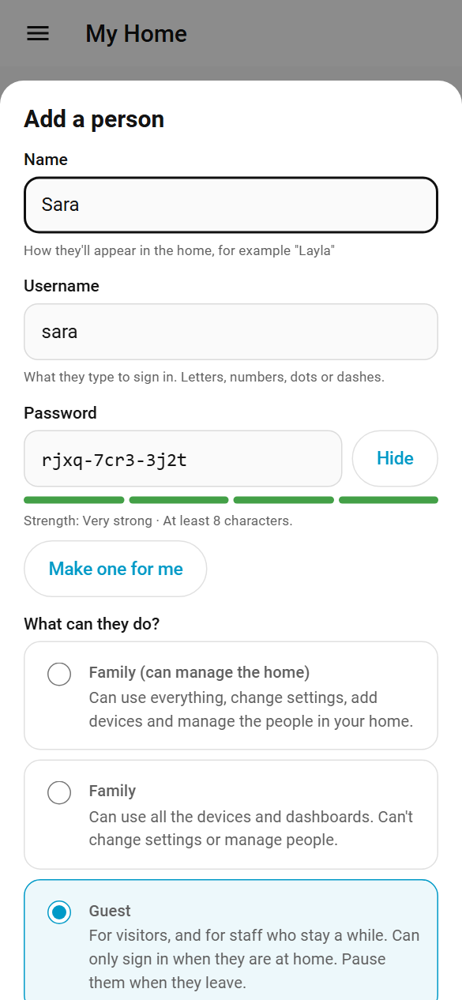

## What each role can do

| Role | Can do |
|---|---|
| **Owner** | Everything. Only one person, set up at installation. Can't be changed from My Home. |
| **Family (can manage the home)** | Everything: settings, devices, and the people in the home. |
| **Family** | Uses every device and dashboard. Can't change settings or manage people. |
| **Guest** | Like Family, but **can only sign in at home**, on your Wi-Fi. For visitors, and for staff who stay a while. |

**Be aware:** while they are signed in, a guest can see and control **every**
device, like any family member. Home Assistant can't limit a person to some
devices. Pause a guest when they leave.

**Can only sign in at home** is also available for anyone else: they can then
sign in only on your home's Wi-Fi, never from outside.

## Change, pause or remove someone

Tap a person to see what you can do.

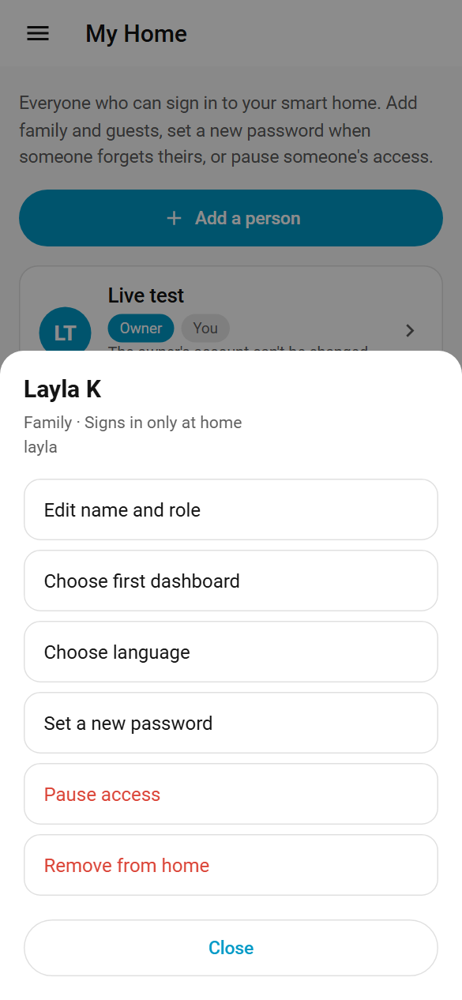

- **Edit name and role.**
- **Choose first dashboard** (see below).
- **Set a new password.** Only the owner can do this, the same rule as Home
  Assistant's own settings. You can also sign them out on all their devices,
  if the old password might be known to someone else. To change your *own*
  password, open your profile (your name at the bottom of the sidebar).
- **Pause access.** They are signed out everywhere and can't sign in until you
  **resume** them. Nothing else changes.
- **Remove from home.** They can't sign in any more and are taken off the list
  of who is home. Your devices, automations and history stay as they are.

My Home always asks before pausing, removing or setting a password.

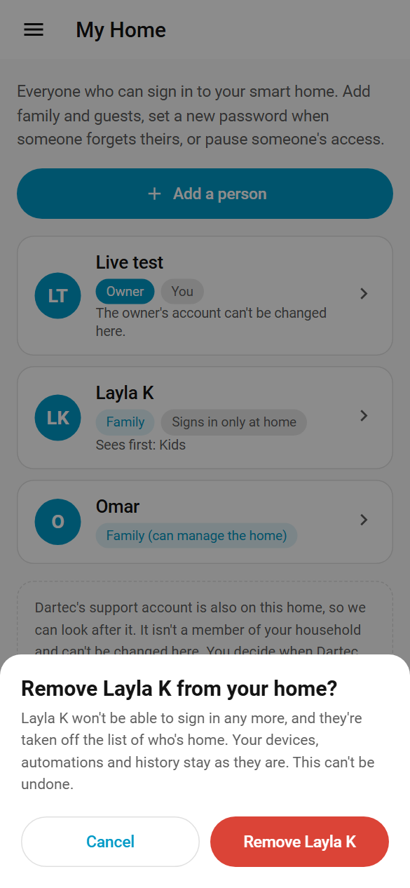

## The first dashboard someone sees

You can choose which dashboard opens first for each person, including the
dashboards your installer set up (marked **From Dartec**).

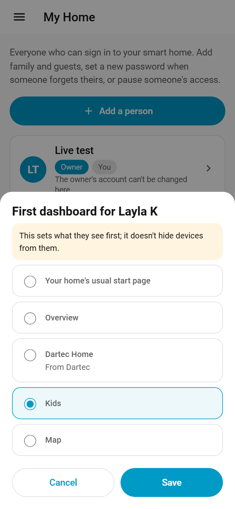

**This sets what they see first; it doesn't hide anything from them.** They
can still open every other dashboard and control every device. It is a
convenience, not a lock.

## What My Home won't do

To keep the home safe, My Home never lets anyone:

- change or remove the **owner**;
- change their **own** role, pause or remove themselves;
- leave the home with **nobody who can manage it**;
- change Dartec's support account or Home Assistant's own system accounts.

**Dartec's support account.** Your installer has an account on your home so we
can look after it. My Home tells you it is there. You decide when Dartec may
make changes, with the **Allow Dartec support** switch. Dartec can't use My
Home, and nothing in My Home is sent to Dartec: we only see how many people
have each role, never their names.

**Every change is recorded** in your home's logbook (Activity in the sidebar),
with the name of whoever made it, and under **Recent changes** in My Home.

## Room panels

A **room panel** is a screen on the wall, such as a tablet, that shows the
controls for one room. Your installer sets each one up with its own account,
named `panel-` and the room (for example `panel-kitchen`). My Home says how
many there are ("Room panels set up by your installer: 2"). They are not
members of your household, are not listed or counted with the people, and
can't be changed from My Home. For the same reason, a person's username can't
start with `panel-`.

**What a room panel's account can do.** Be aware of this, the same way as for
guests:

- It opens on its room's page, and the other pages are hidden from its menu.
  The installer also sets **Always hide the sidebar** on the panel itself: that
  is a setting of the screen's browser, not of the account.
- It can only sign in at home, on your Wi-Fi, and it can't change settings or
  manage people.
- **This keeps the screen on its room. It is not a lock.** Home Assistant has
  no per-device permissions, so a panel's account can still control every
  device in the home through Home Assistant, like any family member's. Treat
  its password like a house key, and ask your installer to remove the panel's
  account when the screen is taken down.

Every time Dartec sets up, moves or removes a room panel, a line is written in
your home's logbook.

---

# بيتي — أفراد منزلك

> الترجمة العربية لم تُراجَع بعد من محرّر ناطق بالعربية.

تجد "بيتي" في الشريط الجانبي لـ Home Assistant، على الكمبيوتر وفي تطبيق
Home Assistant على هاتفك. استخدمها لإضافة أفراد عائلتك وضيوفك، ولتعيين كلمة
مرور جديدة لمن نسي كلمته، ولإيقاف دخول أي شخص مؤقتًا أو إزالته.

لا يراها إلا من يدير المنزل: المالك، ومن تضيفه بصفة **العائلة (يدير المنزل)**.

| الهاتف | الكمبيوتر |
|---|---|
| 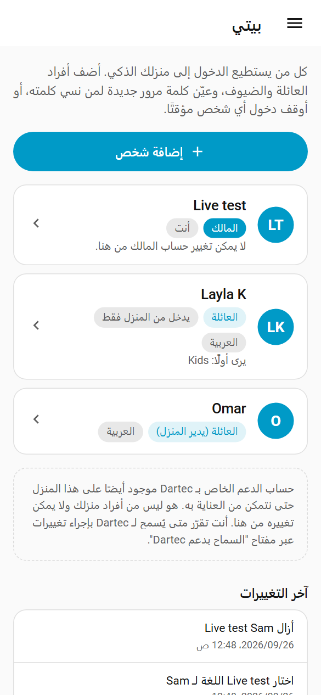 | 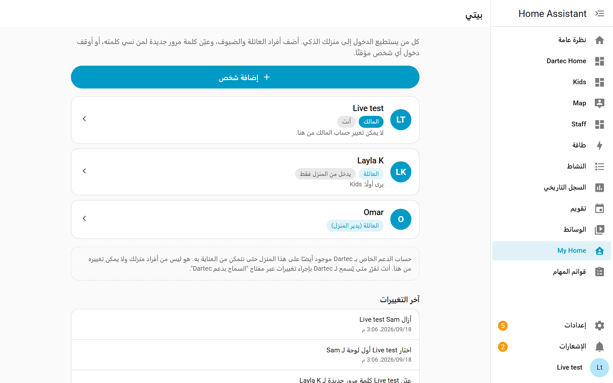 |

## إضافة شخص

1. اضغط **إضافة شخص**.
2. اكتب **الاسم** و**اسم المستخدم** (ما يكتبه للدخول).
3. اكتب كلمة مرور، أو اضغط **أنشئ لي واحدة**. يُظهر الشريط مدى قوتها.
4. اختر **ماذا يستطيع أن يفعل** (انظر أدناه).
5. اختياريًا، اختر **أول لوحة يراها**.
6. اضغط **إضافة الشخص**. تظهر الشاشة التالية اسم المستخدم وكلمة المرور مرة
   واحدة: أعطهما للشخص، أو اضغط **نسخ**.

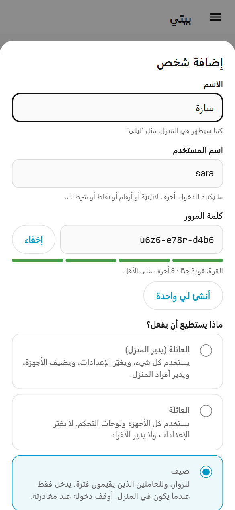

## ماذا يستطيع كل دور أن يفعل

| الدور | يستطيع |
|---|---|
| **المالك** | كل شيء. شخص واحد يُعدّ عند التركيب. لا يمكن تغييره من "بيتي". |
| **العائلة (يدير المنزل)** | كل شيء: الإعدادات والأجهزة وأفراد المنزل. |
| **العائلة** | يستخدم كل الأجهزة ولوحات التحكم. لا يغيّر الإعدادات ولا يدير الأفراد. |
| **ضيف** | مثل العائلة، لكنه **يدخل من المنزل فقط** عبر شبكة Wi-Fi المنزلية. للزوار وللعاملين الذين يقيمون فترة. |

**انتبه:** أثناء دخوله، يستطيع الضيف رؤية **كل** الأجهزة والتحكم بها مثل أي
فرد من العائلة. لا يستطيع Home Assistant حصر شخص ببعض الأجهزة. أوقف دخول الضيف
عند مغادرته.

## التغيير أو الإيقاف أو الإزالة

اضغط على أي شخص لترى ما يمكنك فعله.

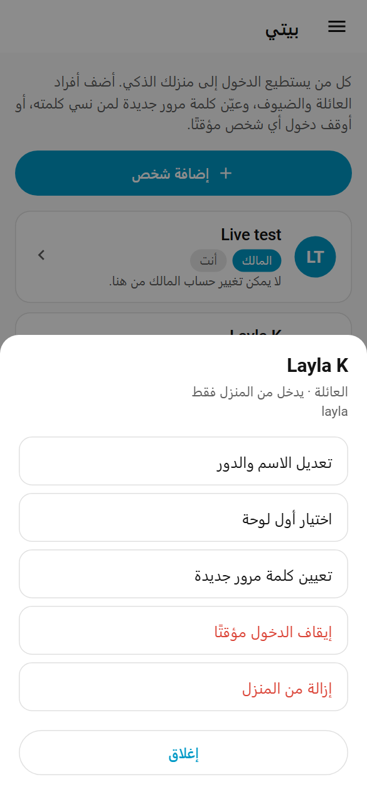

- **تعديل الاسم والدور.**
- **اختيار أول لوحة.**
- **تعيين كلمة مرور جديدة.** المالك وحده يستطيع ذلك، وهي القاعدة نفسها في
  إعدادات Home Assistant. لتغيير كلمة مرورك أنت، افتح ملفك الشخصي.
- **إيقاف الدخول مؤقتًا.** يُخرَج من كل أجهزته ولا يستطيع الدخول حتى
  **تستأنف** دخوله.
- **إزالة من المنزل.** لا يستطيع الدخول بعد الآن. تبقى أجهزتك وأتمتتك وسجلّك كما هي.

تسألك "بيتي" دائمًا قبل الإيقاف أو الإزالة أو تعيين كلمة مرور.

## أول لوحة يراها الشخص

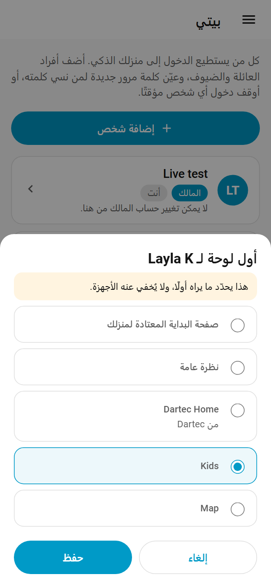

**هذا يحدّد ما يراه أولًا، ولا يُخفي عنه شيئًا.** يستطيع فتح كل اللوحات الأخرى
والتحكم بكل الأجهزة. إنها وسيلة راحة وليست قفلًا.

## ما لا تفعله "بيتي"

لا تسمح "بيتي" لأحد بتغيير **المالك** أو إزالته، ولا بتغيير دوره **هو**، ولا
بترك المنزل **بلا أحد يديره**، ولا بتغيير حساب دعم Dartec أو حسابات
Home Assistant الخاصة بالنظام.

كل تغيير يُكتب في سجلّ منزلك مع اسم من قام به. لا يُرسَل شيء من "بيتي" إلى
Dartec: نرى فقط عدد الأشخاص في كل دور، ولا نرى أسماءهم أبدًا.

## شاشات الغرف

**شاشة الغرفة** شاشة معلّقة على الجدار، مثل جهاز لوحي، تعرض التحكم بغرفة
واحدة. يُعدّ المركّب لكل شاشة حسابًا خاصًا بها، يبدأ اسمه بـ `panel-` ثم اسم
الغرفة (مثل `panel-kitchen`). تذكر "بيتي" عددها ("شاشات الغرف التي أعدّها
المركّب: 2"). ليست من أفراد منزلك، ولا تظهر ولا تُحسب مع الأشخاص، ولا يمكن
تغييرها من "بيتي". ولهذا لا يجوز أن يبدأ اسم مستخدم أي شخص بـ `panel-`.

**ماذا يستطيع حساب شاشة الغرفة أن يفعل.** انتبه لهذا كما في حالة الضيوف:

- يفتح على صفحة غرفته، والصفحات الأخرى مخفية من قائمته. ويضبط المركّب أيضًا
  **إخفاء الشريط الجانبي دائمًا** على الشاشة نفسها: هذا إعداد في متصفح
  الشاشة، وليس في الحساب.
- لا يدخل إلا من المنزل عبر شبكة Wi-Fi المنزلية، ولا يغيّر الإعدادات ولا يدير
  الأفراد.
- **هذا يُبقي الشاشة على غرفتها، وليس قفلًا.** لا يستطيع Home Assistant حصر
  حساب ببعض الأجهزة، فيستطيع حساب الشاشة التحكم بكل أجهزة المنزل عبر
  Home Assistant مثل أي فرد من العائلة. تعامل مع كلمة مروره كمفتاح البيت، واطلب
  من المركّب حذف حساب الشاشة عند إزالتها.

كلما أعدّت Dartec شاشة غرفة أو نقلتها أو أزالتها، يُكتب سطر في سجلّ منزلك.
